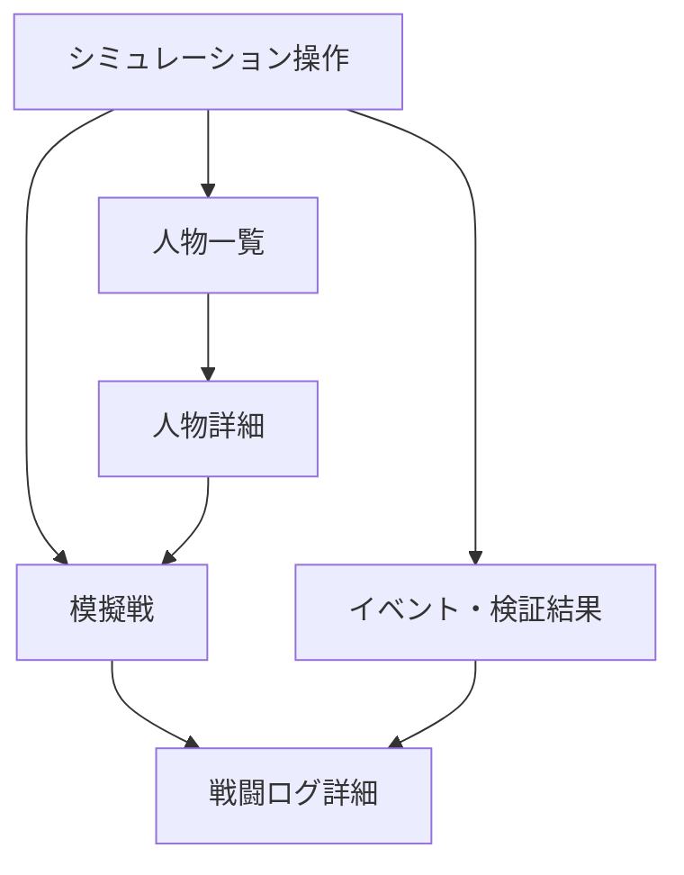
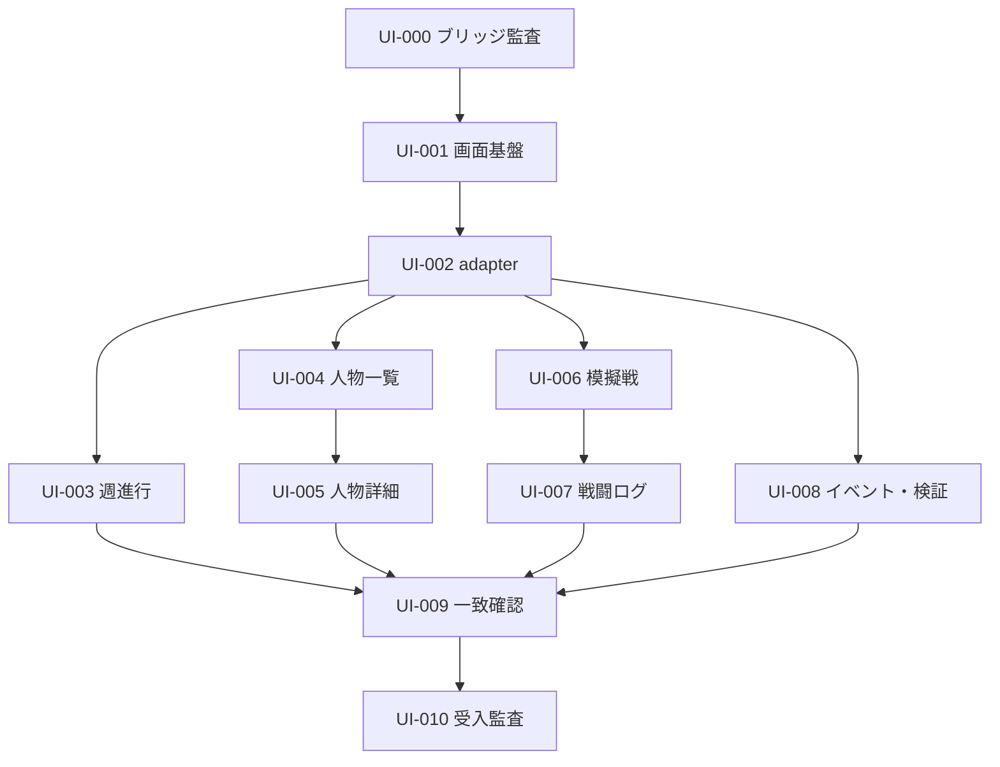

# Sprint 1.5 簡易シミュレーション確認画面仕様

- 文書種別: Sprint 1.5 ミニ仕様
- 対象プロジェクト: dollworld
- 実施時期: Sprint 1完了後、Sprint 2実装着手前
- 主目的: Sprint 1で実装したゲーム内部処理をブラウザ上で確認する
- 位置づけ: 開発・受入確認用UI（本番ゲームUIではない）
- 仕様版: S1.5-SPEC-0.1.13

## 1. 背景

Sprint 0では、ワークスペース、CLI、設定、検証、保存データおよび再現性確認の基盤を構築した。

Sprint 1では、能力、適性、技、週次修行、技習得および戦闘など、ゲーム内部の主要計算処理を実装する。

一方、現状の確認方法はCLI、JSON、CSVおよびログが中心であり、ゲームの動きを人間が継続的に把握しにくい。Sprint 2以降の人生進行、家系、結婚、出産等を接続する前に、Sprint 1の処理をブラウザ上で確認できる簡易画面を設ける。

## 2. 目的

本Sprintでは、次の事項をブラウザ上で確認可能にする。

- 登録人物と現在状態
- 6能力と3適性
- 習得技
- 週次修行による能力変化と技習得
- 正本の模擬戦参加条件を満たす人物間で行う確認専用模擬戦
- 戦闘結果および戦闘中の処理
- イベントおよびValidationResult
- 同一の初期状態、設定、seedによる結果再現性
- CLIと画面が同じsimulation-coreを利用していること

本画面は、本番サービスのUIを先行実装するものではない。Sprint 1の実装結果を確認し、Sprint 2以降の機能を段階的に接続するための開発用画面とする。

## 3. 基本方針

### 3.1 UIの責務

UIは表示、操作受付および結果確認だけを担当する。能力成長、技習得、戦闘その他のゲームルールをUI側へ実装してはならない。

```text
簡易確認画面
  ↓
画面用API／adapter
  ↓
simulation-core
  ↓
ValidationResult・イベント・保存形式
```

### 3.2 必須原則

- CLIと画面は同一のsimulation-coreを使用する。
- 計算式やゲームルールをUIまたはadapterへ複製しない。
- seedによる決定論的再現性を維持する。
- 正規世界の正本となる画面専用人物状態・世界状態を作らない。確認専用模擬戦で用いる切離し済みスナップショットおよび未反映の実行結果は、正規世界と明確に区別する。
- 保存データの正本を二重化しない。
- Sprint 1の既存公開APIの署名、意味および戻り値契約を変更しない。接続に不足がある場合は、既存契約を組み合わせるSprint 1.5用facadeで補う。
- 画面用API／adapterは、simulation-coreが外部公開していない`startBattleTransaction`、`createBattleState`、`beginBattle`、`commitRunBattlePlan`その他の内部stageを直接呼び出さない。Sprint 1完了時点の公開WorldEngine APIだけで正規runと不可分commitを完遂できない場合は、simulation-coreの統合層に最小の`IsolatedMockBattleRunner` facadeを追加する。このfacadeは既存APIの契約を変更せず、内部で正規`runBattleToCompletion`と`commitRunBattlePlan`を順に使用し、中間stageまたはcommit planを画面側へ公開しない。
- adapterはSprint 2以降でも拡張利用できる構造とする。
- 既存CLIは従来どおり単独で動作可能とする。
- UI表示用の整形結果をsimulation-coreへ逆入力しない。
- 経過時間、表示文言、実行日時等の非決定値を正規の世界状態および再現性比較へ混入させない。

### 3.3 実行形態と正本

- Sprint 1.5では、ローカルPC上で起動する単一利用者向けの開発サーバーとPCブラウザを前提とする。
- 外部公開および複数利用者による同時利用は行わず、待受先は標準でloopbackに限定する。
- 1つの画面用セッションにつき、進行可能な正規世界状態は1つだけ保持する。
- 正規世界状態、使用設定、seed、RNG状態および現在時点はサーバー側で一体として管理する。ブラウザから送られた世界状態を正本として採用しない。
- サーバー再起動後の作業再開は保証しない。再起動時は新規開始する。永続セーブは対象外とする。
- 週進行、新規開始、リセットおよび模擬戦実行は直列化し、同一セッションへの複数の更新要求を並行実行しない。更新処理中に届いた別の更新要求はキューへ入れず、競合として拒否する。拒否時は正規世界および確認専用結果領域を変更せず、最新状態の再取得後に利用者が改めて操作する。表示・参照要求は、処理中であることを明示したうえで、処理開始前のcommit済みsnapshotから返す。
- Sprint 1.5の画面用adapterは、画面セッション作成時の0から始まり、画面セッション内の状態変更がcommitされるたびに単調増加する画面用`uiRevision`を保持する。対象は、新規開始、リセット、1週ごとの正規世界commit、対応する`CommittedValidationViewStore`更新、および`MockBattleSessionStore.latest` record全体の置換とする。世界とvalidation storeを同じ週commitで確定する場合や、模擬戦record全体を確定する場合は1回のcommitとして1だけ増加させる。画面セッション状態を変更しない入力エラー、`pre_start_failure`、rollback、競合拒否および同一`requestId`の保存済み応答返却では増加させない。`resolution_error`は複製環境内で正規commitされた確認専用結果を保存するため、record保存commit時に増加させる。
- `uiRevision`は競合検知専用であり、WorldState、SimulationIdentity、canonical JSON、正規イベントまたは再現性比較へ混入させない。
- 更新処理中の表示・参照要求には、処理開始前の最後にcommit済みの正規世界、`CommittedValidationViewStore`および確認専用領域の不変snapshotだけを返す。処理中のdraft、未commitイベント候補または生成器の途中状態を返さない。応答には参照した`uiRevision`と更新処理中か否かを含める。
- 複数週進行中に1週単位commitが成立しても、その更新要求が完了するまでは、参照要求へ返す`operationStartReadSnapshot`を途中のcommit結果へ差し替えない。要求完了後にだけ最新commit済み状態を参照用snapshotとして公開する。これにより、同じGET応答内で世界状態と`uiRevision`が異なるcommit境界を指すことを禁止する。
- 4週、48週および指定週数進行では、各`stepOneWeek`完了後にAPI event loopへ制御を戻し、更新lockを保持したまま参照要求と競合拒否要求を処理可能にする。UI用に週内Processorを分割したりRNG順序を変えたりせず、yieldは1週commit境界の外側だけで行う。実時間の応答保証は設けないが、480週要求全体が同期loopでevent loopを占有し続ける実装は禁止する。
- 画面用セッションは、サーバーが発行する推測困難な識別子で特定する。識別子をURLへ露出させず、ブラウザから任意のセッションIDを指定させない。
- 正規世界のイベント列と、模擬戦等の確認専用結果は別領域で管理する。確認専用処理を正規イベント列、年次統計、RNG状態または世界状態へ追加しない。
- 正規週進行・初期化のcommit時に返されたValidationResultを表示するため、adapter内に`CommittedValidationViewStore`を持つ。このstoreは表示専用で、正規WorldState、Event Stream、固定出力、canonical JSONまたは再現性比較へ混入させない。新規開始・リセット成功時は新runの初期化結果だけへ置換し、1週commit成功時はその週の正規配列順のまま追加する。rollbackされた週、入力エラー、正規状態を変更しないValidationResult失敗および`pre_start_failure`はstoreへ保存せず要求応答だけに含める。複数週の先行成功分は各週commitと同時に保存する。store変更は対応する世界commitと同じ画面セッションcommitに含め、それ自体を理由に`uiRevision`を追加増加させない。

### 3.4 実装構成

- 既存npm workspace内へ、TypeScriptでローカルWebアプリを追加する。
- ブラウザ側はReact＋Vite、ローカルAPI側はFastifyを使用する。実装時のmajor versionは、Sprint 1完了時点でプロジェクトのNode対応範囲を満たす安定版へ固定し、lockfileで再現可能にする。
- simulation-coreはサーバー側だけから参照する。ブラウザbundleへsimulation-core、設定全文、名前データ、正規世界snapshotまたは秘密状態を含めない。
- 画面とAPIは同一originで配信する。開発時のVite分離起動を使用する場合も、ブラウザから見たAPI先は固定proxy経由とし、任意のAPI URLを画面入力させない。
- 正確なworkspace package名、配置path、import可能な公開entry point、起動scriptおよび依存versionはUI-000で実リポジトリへ照合し、接続表に固定する。ここで別frameworkへ変更する場合は、単なる実装判断ではなく本仕様の版上げを必要とする。
- 正規世界、`CommittedValidationViewStore`、確認専用結果、replay snapshot、`requestId`応答および`uiRevision`はAPI processのメモリ内に保持する。DB、localStorage、IndexedDBまたはブラウザ送信snapshotを正本にしない。

### 3.5 画面セッション状態

画面セッションの状態を次の3つに固定する。

```text
empty     : セッションは存在するが正規世界は未開始
ready     : 最後にcommit済みの正規世界を参照・更新可能
updating  : 更新処理中。参照は直前のcommit済みsnapshotだけを返す
```

wire上の3状態を、server内部で独立した3値として重複保存しない。内部画面セッションの包含関係を次へ固定する。

```text
UiSessionState 0.1.0 = {
  sessionId: secret session identifier,
  csrfToken: secret token,
  committedLifecycle: "empty"|"ready",
  uiRevision: non-negative safe integer,
  worldEngineRuntime: null|WorldEngineRuntimeState,
  runInitializationSnapshot: null|RunInitializationSnapshot,
  committedValidationStore: null|CommittedValidationViewStore,
  mockBattleStore: MockBattleSessionStore,
  requestJournal: Map<requestId, RequestJournalRecord>,
  lastOperationRequestId: string|null,
  updateControl: null|{
    requestId: string,
    operationKind: "start"|"step"|"reset"|"mock_battle"|"mock_battle_replay",
    operationStartReadSnapshot: immutable UiReadSnapshot
  }
}

UiReadSnapshot 0.1.0 = {
  committedLifecycle: "empty"|"ready",
  uiRevision: non-negative safe integer,
  worldEngineRuntime: null|immutable WorldEngineRuntimeState,
  committedValidationStore: null|immutable CommittedValidationViewStore,
  mockBattleStore: immutable MockBattleSessionStore,
  lastOperationRequestId: string|null
}
```

`committedLifecycle=empty`ではworld runtime、初期化snapshot、validation store、lastOperationRequestIdをすべて`null`、`uiRevision=0`とし、mock storeは`latest=null`とする。受理済みstartが422／500で失敗してjournal recordだけが存在してもこの条件を変えない。`committedLifecycle=ready`ではworld runtime、初期化snapshotおよびvalidation storeをすべて非nullとし、simulationIdを一致させる。lastOperationRequestIdは開始成功後必ず非nullで、HTTP 200 completed journalを参照する。mock latestはnullまたは同じ画面セッションの整合recordとする。

wireの`sessionState=updating`およびtop-level `isUpdating=true`は`updateControl!=null`からだけ導出し、別boolean／enumを保存しない。updateControlが非nullなら、同じrequestIdのrunning journal recordが正確に1件存在し、activeOperationはoperationKindとrequestIdから導出する。`operationStartReadSnapshot`は受理直前のcommitted表示状態、validation store、mock storeおよびlastOperation参照を可変共有なしで固定する。受理前検証中はevent loopへyieldせず、running recordとupdateControlを同じ不可分境界で作成する。完了時はcompleted journal確定とupdateControl解除を同じ境界で行い、orphan lock、running recordなしのupdating、または複数running recordを許可しない。

- 初回アクセス時にサーバーが画面セッションを作成し、状態を`empty`、`uiRevision=0`とする。
- `empty`で許可する更新操作は新規開始だけとする。週進行、リセット、模擬戦および人物・イベント取得は、正規世界未開始を表す安定したエラーコードで拒否する。preset一覧とセッション状態の取得は許可する。
- ブラウザreload後も、同じサーバーprocessと同じセッションcookieが有効な間は同一画面セッションを再取得する。サーバー再起動後は旧cookieを無効として新しい`empty`セッションを発行する。
- 単一利用者向けのため、セッションの永続化、複数端末共有、復旧、exportおよびimportは行わない。メモリ上のセッションはサーバー停止時に破棄する。
- `updating`は画面用adapterの一時状態であり、WorldState、canonical JSON、正規イベントおよび再現性比較へ含めない。更新の成功または失敗後は必ず`ready`または元の`empty`へ戻す。

## 4. 対象画面

### 4.1 シミュレーション操作画面

簡易確認画面のトップとする。

#### 表示項目

- simulationId
- 使用seed
- 初期世界設定のprofileId／config hash
- Sprint1ConfigのconfigVersion／config hash
- `TechniqueCatalogIdentity`（dataVersion／catalogHash）
- 名前データのnameDataVersion／nameDataHash
- SimulationIdentity schema版、仕様版集合、RNG版、canonical JSON版、人物adapter版、MatchId generator版、DefaultBattleStrategy版およびhash algorithm
- initialMatchIdGeneratorStateHash
- simulationIdentityHash
- runRuleSnapshotHash
- 現在の年・月・週
- 経過週数
- 登録人物数
- 直前の実行結果

#### 操作

- 新しいシミュレーションを開始する。
- 1週間進める。
- 4週間進める。
- 1年進める。
- 指定週数進める。
- 初期状態からやり直す。

正規世界が未開始の`empty`状態では、新規開始とpreset選択だけを有効にし、それ以外の操作領域には「シミュレーション未開始」と表示する。更新中は更新ボタンを無効化するが、サーバー側の競合拒否を省略してはならない。

#### 新規開始時の入力

- サーバー側で許可された実行presetの選択
- seed（必須）

実行presetは、サーバー側で許可された初期世界設定、Sprint1Config、TechniqueCatalog、名前データおよび正規の版情報の組合せを参照する選択肢とする。preset IDは画面用adapterの検索キーにすぎず、SimulationIdentity、各config hash、`TechniqueCatalogIdentity`またはrunRuleSnapshotHashの代替にしない。ブラウザからファイルパス、任意の設定内容、hashまたは版文字列を送信して読み込ませない。seedは必須入力とし、その許容範囲と形式を既存CLIおよびsimulation-coreの正規契約に一致させる。未入力を拒否し、時刻、実行日時または暗黙の乱数から補完しない。

UI-000で、Sprint 1受入に使用した正規設定を参照する既定presetを少なくとも1件登録する。preset一覧には表示名とpreset IDだけでなく、seed確定前に一意となる初期世界設定、Sprint1Config、TechniqueCatalog、名前データ、暦、年初manifestおよび承認済み仕様版のidentity／hash／versionを表示用metadataとして返す。`SimulationIdentity`、`simulationIdentityHash`、`simulationId`、`RunRuleSnapshot`および`runRuleSnapshotHash`はseedと初期MatchId generator stateに依存するためpreset metadataへ含めず、start要求のseed確定後にだけ生成する。開始時にはmetadataを信用して処理せず、サーバー側registryから完全な入力を再解決・再検証する。

preset registryはserver process起動時に全entryのpresetId一意性、完全入力、各正規schema、identity／hash／version相互参照を検証し、1件でも不正ならAPI待受を開始しない。検証済みregistry snapshotはprocess終了まで不変とし、元ファイル変更の監視、hot reload、要求ごとの再読込または部分更新を行わない。`GET /presets`と`POST /simulation/start`は同じ不変registry snapshotを参照する。変更反映にはprocess再起動が必要で、旧画面セッションは同時に失効する。

指定週数の入力可能範囲は1～480週を初期値とする。長期性能検証は既存CLIで実施し、ブラウザ画面では日常的な動作確認を優先する。

「1年進める」は、本体`SPEC.md`の暦と進行単位に従って48週を進める操作とする。Sprint 1.5側で1年の長さを再定義せず、正規の週進行処理を48回実行した場合と同一結果にする。現在承認済みのゲーム設定では`worldYearStartMonth=1`であり、出生、一斉加齢、入門、デビュー、引退、結婚、出産、家系、始祖参加および年間日程を含む年初処理全体を1月第1週に実行する。UIへ`1`をハードコードせず、検証済みの共通年初月設定を表示・参照する。将来この設定を変更した新規runでは年初処理全体が同じ設定月へ一括移動し、run途中では変更しない。

新規開始時には、選択したpresetが参照する完全な入力を正規手順で検証し、初期世界設定のprofileId／config hash、`Sprint1ConfigIdentity`、`TechniqueCatalogIdentity`、nameDataVersion／nameDataHash、SimulationIdentity、simulationIdentityHash、RunRuleSnapshot、runRuleSnapshotHashおよびseedを確定する。Sprint 1.5独自の設定hash、catalog hash、simulation identity、run rule hashまたはそれらの代替identityを作成しない。開始後に同じセッションの設定やseedだけを差し替えることはできない。開始後に元ファイルまたはpreset定義が変更されても、実行中の世界へ変更を混入させない。

「初期状態からやり直す」は、現在の世界を作成したものと同一の正規設定スナップショットとseedを用いて新たに初期化する。現在状態を部分的に巻き戻してはならない。新規開始およびやり直しは現在状態を置き換えるため、実行前に確認を表示する。

開始成功時に、resetへ必要な決定的入力をserver側画面セッションの不変`RunInitializationSnapshot 0.1.0`として1件だけ保存する。

```text
RunInitializationSnapshot 0.1.0 = {
  schemaVersion: "0.1.0",
  presetId: string,
  seed: uint32,
  initialWorldConfig: CanonicalObject,
  initialWorldConfigHash: lowercase 64-hex string,
  validatedNameData: CanonicalObject,
  nameDataVersion: string,
  nameDataHash: lowercase 64-hex string,
  simulationIdentity: CanonicalObject,
  simulationIdentityHash: lowercase 64-hex string,
  runRuleSnapshot: CanonicalObject,
  runRuleSnapshotHash: lowercase 64-hex string
}
```

`CanonicalObject`の意味は7.1.1節と同じとする。各本文とhash／version、SimulationIdentityとRunRuleSnapshotの相互参照を開始前に正規validatorで検証する。特に`canonicalJson(initialWorldConfig.worldCalendar) = canonicalJson(runRuleSnapshot.worldCalendar)`かつ両方の`worldCalendarConfigHash`一致を必須とする。進行時はRunRuleSnapshot側だけを参照し、初期化snapshot内の値を第2の可変calendarとして使わない。`presetId`は由来を示すadapter metadataにすぎず、reset時の再解決keyまたは正規identityとして使わない。完全Sprint1ConfigとTechniqueCatalogは正規RunRuleSnapshot内の保存値を使用し、別fieldへ複製しない。`RunInitializationSnapshot`自体の独自hashをSimulationIdentityへ追加しない。

resetは保存済み`RunInitializationSnapshot`だけから初期化入力を再構築し、preset registry、元設定ファイル、現在の既定値またはブラウザmetadataを再読込しない。snapshotの必須本文・hash・version・相互参照が1件でも欠落または不一致なら、旧世界を維持してresetをcommit前に失敗させる。新規開始成功時は新snapshotへ置換し、reset成功時は同じsnapshotを維持する。新規開始／reset失敗時は既存snapshotを変更しない。snapshotは画面セッション終了時に破棄し、WorldState、正規イベント、canonical世界比較、cursorまたはresponse DTOへ混入させない。

新規開始およびやり直しでは、新しい初期状態、RNG状態、MatchIdGeneratorState、ProcessorRuntimeState、イベント状態およびRunRuleSnapshotを旧状態と分離して構築・検証する。全初期化が成功した場合だけ、正規世界、`RunInitializationSnapshot`、`CommittedValidationViewStore`および`MockBattleSessionStore.latest=null`を同じ画面セッションcommitで一括置換し、`uiRevision`を1増加させる。resetでは検証済みの同一`RunInitializationSnapshot`値を新しい画面セッション状態へ引き継ぐ。初期化に失敗した場合は旧状態、旧snapshot、旧storeおよび`uiRevision`を維持する。

#### 実行結果

- 実行週数
- 発生イベント数
- 能力上昇件数
- 技習得件数
- 確認専用模擬戦件数
- 正規処理から返されたValidationResult件数
- 処理時間

実行結果は操作種別ごとに該当する項目だけを表示する。通常の週進行は確認専用模擬戦を生成しないため、その件数は常に0とし、別操作で実行した模擬戦を週進行の発生件数へ加算しない。

### 4.2 人物一覧画面

世界に登録されている人物の現在状態を一覧表示する。

| 項目 | 内容 |
|---|---|
| 名前 | 人物の表示名 |
| 年齢 | livingは正規の現在年齢、deceasedは「死亡時X歳」 |
| 所属 | 現在実装済みの家系・流派等 |
| 状態 | lifeStatus、livingだけのparticipationStatus、careerStatus |
| 総合ランク | Sprint 1完了時点で値が存在する場合のみ表示 |
| stamina | 持久力 |
| strength | 筋力 |
| skill | 技量 |
| speed | 速度 |
| spirit | 精神力 |
| magic | 魔力 |
| unarmed | 格闘適性 |
| sword | 剣技適性 |
| magic aptitude | 魔法適性 |
| 習得技数 | 現在習得している技の数 |

#### 操作

- 人物詳細を開く。
- 名前で絞り込む。
- 実装済みの人物状態で絞り込む。
- 能力値で並べ替える。
- 適性で並べ替える。

人物一覧はサーバー側ページングを必須とし、既定50件、選択可能な表示件数を50／100／200件、最大200件とする。既定順は`personId`の昇順とし、同値となり得る表示項目で並べ替える場合も最終tie-breakを`personId`昇順へ固定する。名前絞り込み、状態絞り込み、能力・適性の並べ替えを適用した後の総件数と次cursorを返す。cursorは画面セッションと`uiRevision`に結び付け、revisionが変わった古いcursorは拒否して先頭から再取得させる。

複合検索、保存済み検索条件および任意件数指定は実装しない。ブラウザDOMへ全人物を一括描画せず、5,000人の世界でも1ページ最大200行を維持する。

### 4.3 人物詳細画面

選択した人物1名の内部状態と直近の変化を表示する。

#### 基本情報

- personId
- 名前
- lifeStatus
- birthYear
- livingの場合は現在年齢、deceasedの場合はdeathYear／ageAtDeath
- 所属
- 師匠
- 親
- lifeStatus、participationStatus、careerStatus

値が未実装または未設定の場合は、架空の値で補完せず「未設定」または「対象外」と表示する。

#### 能力

- stamina
- strength
- skill
- speed
- spirit
- magic

履歴から安全に算出できる場合は、各能力について次も表示する。

- 初期値
- 現在値
- 直近48週の増加量
- 直近週の増加量

算出に必要な正規データが存在しない場合、画面専用の履歴保存は追加せず、その項目は表示対象外とする。

#### 適性

- unarmed
- sword
- magic

#### 技状態（学習中・習得済み）

| 項目 | 内容 |
|---|---|
| 技名 | 技の表示名 |
| 種別 | unarmed／sword／magic |
| 習得状態 | 現在の正規状態 |
| 使用条件 | 間合い・必要能力等 |
| 威力 | 実装済みの技性能 |
| 命中関連値 | 実装済みの場合のみ表示 |
| 消費・使用回数 | spirit等による制限 |
| priority | 技が選択された後の行動順判定等に使用する`TechniqueDefinition.priority`。人物ごとの優先技設定ではない |

人物の`currentMental`と`learningFocusTechniqueId`を表示し、各保持済み技について`learningProgressTenths`、`masteryHundredths`、成功／試行回数、最終練習週および習得週を表示する。tenths／hundredthsの保存値を表示用に丸めた値だけへ置き換えず、監査可能な元整数も保持する。

#### 修行履歴

正規イベントまたは保存済み履歴から取得可能な直近48週分を表示する。本体`SPEC.md`の1年＝48週に合わせ、Sprint 1.5独自の年の長さを設けない。

- 実行年・月・週
- 修行内容
- 指導者
- 上昇した能力
- 上昇量
- 技習得判定
- 習得した技
- 関連イベント

### 4.4 模擬戦画面

正本の模擬戦参加条件を満たす異なる人物2名を選択し、Sprint 1の戦闘処理を確認専用に実行する。

選択可能な人物は、`11-battle-state.md`の`battleKind=mock`の開始条件に従い、少なくとも次をすべて満たす人物に限定する。

- 同一人物同士ではない
- PersonIdが存在し一意である
- 存命で、`participationStatus=active`である
- `trainee`かつ8～15歳、または`active_competitor`かつ16～41歳である
- 能力、適性、一時状態、Sprint 1人物状態および技参照が有効である
- 負傷度が戦闘開始不能閾値未満である

条件を満たさない人物は選択不可とし、正規ValidationResult等から判定理由を表示できる場合はその理由を表示する。UI独自の例外資格を設けない。

#### 入力項目

- 対戦人物A
- 対戦人物B
- 使用する`Sprint1ConfigIdentity`、`TechniqueCatalogIdentity`、simulationIdentityHash、runRuleSnapshotHashおよび`BattleActionSourceIdentity(default_strategy)`の表示
- 確認元となる正規世界の時点・`uiRevision`の表示

#### 操作

- 1試合実行する。
- 同一条件で再実行する。

模擬戦は確認専用とし、人物の能力、精神、負傷、技熟練度、勝敗、戦績、イベント、World RNG、MatchIdGeneratorStateその他の正規世界状態へ反映しない。実行前に、正規世界状態、人物状態、World RNG、MatchIdGeneratorState、RunRuleSnapshotおよび模擬戦のcommitに必要な実行時状態を、可変参照を一切共有しない分離複製環境へ複製する。複製または正規検証に失敗した場合は模擬戦を開始しない。

分離複製環境内では、Sprint 1完了時点の公開WorldEngine API、または前項の`IsolatedMockBattleRunner` facadeを使用する。`runBattleToCompletion`が`RunBattleCommitPlan`を返すだけの場合、それ自体をcommit完了とみなさない。facadeまたは公開WorldEngine統合層の内部で、正規`commitRunBattlePlan`が定めるWorld RNG、MatchIdGeneratorState、人物効果、`battle.started`／`battle.finished`候補およびBattleResultの不可分commitを最後まで完遂する。

この確認専用実行は、複製checkpointから作成した一時的な同週トランザクション内で行う。週を進めたり正規の週間Processorを再実行したりしない。`commitRunBattlePlan`が追加した`battle.started`／`battle.finished`はEventId／simulationId／global sequence未割当の候補のまま抽出し、「確認専用イベント候補」としてだけ表示する。共通Event Stream append層で正規EventEnvelopeへ包まず、正規イベントであるかのようなIDまたはsequenceをSprint 1.5側で発行しない。

画面用API／adapterから`startBattleTransaction`、`createBattleState`、`beginBattle`または`commitRunBattlePlan`を個別に直接呼び出さず、start runtime、RunBattleCommitPlan、BattleResult、人物効果またはイベントだけを部分commitするSprint 1.5専用APIも設けない。`IsolatedMockBattleRunner`が返すのは、commit済みの複製環境から抽出した最終結果または失敗結果だけとする。

commit成功後は、battleSeed、詳細ログおよび検証結果を各1正本として内包するBattleResult、確認専用イベント候補、参照revisionおよび直前の模擬戦開始前の分離複製環境を再構築できる完全な不変`MockBattleReplaySnapshot`を、正規イベントとは異なる画面セッション内の`MockBattleSessionStore.latest`へ最新1件だけ保存する。battleSeed、表示用戦闘ログまたは検証結果をBattleResult外へ複製保存しない。

確認専用結果とreplay入力を別々のnullable fieldへ分離せず、画面セッション内の次のstrict storeへ一体保存する。

```text
MockBattleSessionStore 0.1.0 = {
  schemaVersion: "0.1.0",
  latest: null | {
    resultUiRevision: non-negative safe integer,
    battleResult: CanonicalObject,
    eventCandidates: CanonicalObject[],
    replaySnapshot: MockBattleReplaySnapshot
  }
}
```

未実行、新規開始成功およびreset成功では`latest=null`とする。新規模擬戦またはreplayの`completed|resolution_error` commit成功時だけlatest object全体を1回で置換し、`resultUiRevision`は同commit後の`uiRevision`、元world revisionは`replaySnapshot.sourceWorldUiRevision`の1か所だけに保持する。event候補は正規runnerのsource順を維持する。詳細logとcommit済み結果validationは、それぞれ`battleResult.detailedLog`と`battleResult.validation`だけを正本とし、store内に第2配列または第2objectを作らない。結果またはsnapshotの片方だけが存在する状態、各revisionが不一致の状態、およびwire用`MockBattleView`を正本として保存することを禁止する。`GET /mock-battles/latest`とlog endpointはこのrecordの同じread snapshotからDTOを構築し、log endpointは`battleResult.detailedLog`を正規index順にページングする。

`MockBattleReplaySnapshot`はSprint 1.5 adapterが保持する一時コンテナであり、simulation-coreの正規保存型へ追加しない。wireへ公開しないstrict schemaを次へ固定する。

```text
MockBattleReplaySnapshot 0.1.0 = {
  schemaVersion: "0.1.0",
  sourceWorldUiRevision: non-negative safe integer,
  runtimeCheckpoint: CanonicalObject,
  participantAId: string,
  participantBId: string,
  battleKind: "mock",
  participantAActionSourceIdentity: CanonicalObject,
  participantBActionSourceIdentity: CanonicalObject
}
```

全field必須、未知field・`null`・同一人物IDを禁止する。`runtimeCheckpoint`はSprint 1完了時点の公開`WorldEngineRuntimeState`または正規の同等checkpointをcanonical snapshot化した1 objectとし、模擬戦開始前のWorldState、World RNG、MatchIdGeneratorState、各ProcessorRuntimeState、EventAllocationState（次global sequenceとEventId導出契約）、Event Stream、同週トランザクション状態およびRunRuleSnapshotを完全復元できなければならない。EventIdはglobal sequenceから正本式で純粋導出し、独立した可変EventId generatorを新設しない。checkpointの実型、schemaVersion、clone／restore／validation関数および包含field pathはUI-000で1件に固定する。参加者ID、`battleKind=mock`および両`BattleActionSourceIdentity`はcheckpointと正規factoryから再検証可能な同一値を保存し、replay時に現在world、presetまたは表示DTOから補完しない。一部だけをUIが推測して再構成してはならない。

このsnapshotは正規世界の正本または進行可能な第2世界として扱わず、画面から編集できないものとし、再実行時には毎回さらにcloneして使用する。新規開始、リセットまたは画面セッション終了時に`MockBattleSessionStore.latest`全体とともに破棄し、次の新規模擬戦がcommit可能な結果と新snapshotを確定した時点でrecord全体を置き換える。新しい模擬戦の入力検証失敗だけを理由に、直前の有効なrecordを失わない。

commit後の実行済み複製世界状態、複製World RNG、複製MatchIdGeneratorState、複製人物状態および複製イベント列は表示用データと`MockBattleReplaySnapshot`の確定後に破棄する。正規世界に対して戦闘commitを実行してはならず、確認専用結果を正規イベント列、人物戦績、年次統計、World RNGまたはMatchIdGeneratorStateへ転記しない。

入力エラーまたは`pre_start_failure`は要求への失敗応答として表示するが、保存済み`MockBattleSessionStore.latest`を置き換えず、`uiRevision`も増加させない。`completed`または`resolution_error`の不可分commit成功後にだけ、latest record全体を同じ画面セッションcommitで置換する。

Sprint 1の標準週間Plannerには模擬戦・公式戦がまだ含まれないため、通常の週進行から戦闘が発生することをSprint 1.5の前提にしない。Sprint 1.5で表示する戦闘は、この確認専用模擬戦に限定する。

両参加者の行動供給源は、RunRuleSnapshotに固定された`DefaultBattleStrategy`を使用する。画面から優先技、行動スクリプト、技選択、戦闘係数または設定内容を差し替える機能は設けない。技定義が持つ`priority`等は表示してよいが、画面入力値にはしない。

#### 結果表示

- matchId、simulationId、battleKind
- resultKind
- 勝者（`completed`の場合）
- 敗者（`completed`の場合）
- 決着方法
- judge_decisionの有無
- turnsExecuted
- 使用技
- 命中・回避結果
- ダメージ
- 間合い変化
- 終了理由
- battleInputHash、両参加者のsourceSnapshotHashおよび開始時worldDate
- runRuleSnapshotHash、Sprint1Config identity、TechniqueCatalog identity、両BattleActionSourceIdentity
- `BattleResult.finalState`
- 再現性確認に必要なRNG情報

戦闘開始時の人物状態全文は、Sprint 1の正規BattleResultまたはログが保持する場合だけ表示する。表示のために最終状態から逆算したり、現在の正規世界から再取得した値を開始状態として表示したりしない。`MockBattleReplaySnapshot`の内部状態をそのままブラウザへ公開することも行わない。

`resultKind=completed`の通常結果にdrawは設けない。最大ターン到達時は、既存仕様どおり`endReason=judge_decision`へ変換して勝者を確定する。一方、`resultKind=failed`かつ`endReason=resolution_error`は試合結果の成立ではなく、`winnerPersonId`と`loserPersonId`をともに`null`としてエラー内容を表示する。`resolution_error`をdrawまたは判定決着として扱わない。

RNG内部状態の無制限な公開は必須としない。既存契約を破壊せず、同一条件を再現・比較するために必要な情報だけを表示する。

#### 再実行とRNG規則

- 画面から`battleSeed`を直接指定しない。
- 戦闘開始時は、切離し済み実行コンテキストのWorld RNGから、正本どおりuint32を固定1回だけ取得して`battleSeed`とする。
- 戦闘入力検証に失敗した場合は、確認専用のWorld RNGとMatchIdGeneratorStateも消費しない。
- 「同一条件で再実行」は、保存済み`MockBattleReplaySnapshot`から直前の試合開始前の分離複製環境を再構築し、標準戦闘実行入口で同一結果になることを確認する。現在の正規世界がその後進行していても、再実行入力へ混入させない。
- 明示的な「同一条件で再実行」は新しい実行要求であるため、新しい`requestId`を使用する。同一`requestId`の再送は通信再試行として保存済み応答を返すだけであり、再実行操作として扱わない。
- 戦闘内部RNG、Strategy用派生seedおよび最終判定のRNG消費は、`07-seeded-rng.md`および戦闘仕様の正規契約に従う。Sprint 1.5独自のseed導出方式を追加しない。
- 10試合・100試合等の統計用一括実行はSprint 1.5の対象外とし、必要な場合は別途、正規RNG・状態遷移契約に従う検証ツールとして定義する。

### 4.5 戦闘ログ詳細画面

Sprint 1.5の確認専用模擬戦について、処理順にログを表示する。後続Sprintで正規世界内の戦闘が実装された後は、その正規戦闘ログにも同じ表示部品を拡張利用できる。

#### 表示項目

- 処理番号
- 行動者
- 行動種別
- 使用技
- 開始時の間合い
- 命中判定結果
- 回避判定結果
- ダメージ
- 終了時の間合い
- 表示可能なRNG判定結果
- 補足理由

通常表示は人間が読める日本語とし、内部データだけを表示する画面にはしない。調査用として、対応する正規JSONを折りたたみ表示できるようにする。

正規JSONはHTMLとして解釈せず、エスケープ済みのテキストとして表示する。人物名、技名、エラー内容その他の動的文字列も同様に安全なテキストとして表示し、未検証HTMLを挿入しない。巨大なログによって画面が停止しないよう、詳細ログはサーバー側で既定100件、最大200件に分割し、cursorによる追加表示またはページ切替を可能にする。cursorは対象の`resultUiRevision`と現在の`uiRevision`に結び付け、結果が置換された後または画面状態が進んだ後の古いcursorを拒否する。表示上限によってBattleResultまたは正規イベント自体を改変してはならない。

### 4.6 イベント・検証結果画面

現在のシミュレーションで発生した正規イベントと、正規commitに対応して`CommittedValidationViewStore`へ保存されたValidationResultを表示する。rollbackされた処理またはcommitを伴わない失敗のValidationResultは、その要求応答のerror summaryへ表示し、現在シミュレーションの保存済み一覧へ混入させない。確認専用模擬戦の結果、ログ、検証結果および複製環境内の`battle.started`／`battle.finished`は正規イベント一覧へ表示しない。

同じメニュー内に確認専用模擬戦結果の独立した表示領域を設け、見出し、取得APIおよびデータソースを正規イベント領域と分離する。確認専用模擬戦から戦闘ログ詳細へ遷移する場合も、正規EventEnvelopeとして扱わない。Sprint 1.5時点の標準週間Plannerは戦闘を生成しないため、正規イベント側の戦闘件数は発生を前提としない。

#### 絞り込み

- 年・月・週
- personId
- イベント種別
- 修行
- 技習得
- ValidationResult code

年・月・週、personId、イベント種別、修行および技習得は正規イベント領域へ適用し、ValidationResult codeはValidationResult領域だけへ適用する。両領域へ同じfilterを暗黙適用しない。

正規イベント一覧もサーバー側で既定100件、最大200件に分割する。既定順は`sequence`昇順とし、cursorをsimulationIdと`uiRevision`へ結び付ける。絞り込み後も順序を変更しない。正規イベントがメモリに全件存在していても、ブラウザへ全件を一括送信・描画しない。

正規イベントとValidationResultは、順序キー、件数および更新契約が異なるため、同じitems配列または同じcursorへ混在させない。正規イベントは`GET /events`、ValidationResultは`GET /validation-results`から別々に取得する。画面上で同じメニューに表示しても、各領域が独立したloading、empty、errorおよびページング状態を持つ。

#### ValidationResult表示

- 成否
- エラーコード
- 対象パス
- エラー内容
- 発生処理
- 処理継続可否（既存の正規結果から判定可能な場合のみ）

ValidationResultは既存の正規結果を表示し、画面用の独自エラー形式だけへ置き換えない。確認専用模擬戦の検証結果には明確な「確認専用」表示を付け、正規世界のValidationResultと結合しない。入力エラーまたは`pre_start_failure`のValidationResultは要求応答として表示し、保存済み確認専用結果へ混入させない。

正規ValidationResult一覧の既定順は、画面セッション内で正規結果を受領した順にadapterが付与する表示専用`validationOccurrence`昇順とする。この値はページング専用であり、正規ValidationResult、WorldState、イベント、canonical JSONまたは再現性比較へ書き戻さない。同じ正規処理が返した配列内では元の配列順を維持する。

`validationOccurrence`は新規開始・リセット成功時に1から振り直し、初期化結果の正規配列順に連番を付ける。週commitでは直前最大値+1から連番を付け、対応する世界commitと同時に確定する。rollback、入力失敗またはstore非保存結果では番号を予約・消費せず、保存済み一覧内に欠番を作らない。

画面セッション内storeを次のstrict schemaへ固定する。

```text
CommittedValidationViewStore 0.1.0 = {
  schemaVersion: "0.1.0",
  simulationId: string,
  items: {
    validationOccurrence: positive safe integer,
    result: CanonicalObject
  }[],
  nextValidationOccurrence: positive safe integer
}
```

`items`は`validationOccurrence`昇順で1から欠番なく並べ、空なら`nextValidationOccurrence=1`、非空なら末尾値+1とする。新規開始・reset成功時は新しいsimulationIdと初期化ValidationResultからstore全体を構築し、正規世界および`uiRevision`と同じ画面セッションcommitで置換する。週進行ではcommit対象週が返した正規配列へnext値から連番を付け、世界state、Event Stream、store items、next値および`uiRevision`を同じ1週境界でcommitする。rollback時はitemsとnext値をともに復元する。確認専用模擬戦、strict入力失敗、pre-start failureおよび予期しない未commit候補をこのstoreへ追加しない。storeはadapter表示状態であり、WorldState、SimulationIdentity、正規canonical JSONおよびCLI比較へ含めない。

## 5. 共通ナビゲーション

共通メニューは次の4項目とする。

- シミュレーション
- 人物
- 模擬戦
- イベント

画面遷移は次のとおりとする。



## 6. データ更新方針

画面から人物や世界の正規データを直接編集する機能は設けない。

### 6.1 許可する操作

- 新しいシミュレーションの開始
- 正規処理による週の進行
- 世界状態へ影響しない模擬戦の実行
- 表示対象および絞り込み条件の変更

### 6.2 禁止する操作

- 能力値の直接変更
- 適性の直接変更
- 技の直接追加・削除
- 年齢・生年の直接変更
- 家系、親子、婚姻、師弟関係の直接変更
- 正規処理を経由しない人物状態変更
- イベントまたはValidationResultの改変

初期条件を変更する場合は、既存の設定ファイルおよび正規の初期化処理を使用する。

## 7. エラー処理

- 入力エラー、ValidationResult失敗、実行時エラーを区別して表示する。
- 失敗した処理を成功扱いせず、成功部分と失敗部分を曖昧に結合して表示しない。複数週要求で先行週がcommit済みの場合は、その成功週数と失敗週を明示する。
- 世界状態を更新する処理では、失敗時の状態を既存契約に従って維持または復元する。
- UIの表示エラーによってsimulation-coreの状態を破壊しない。
- 不明な例外内容やスタックトレースを通常画面へ無制限に露出しない。
- 開発時に必要な詳細は、開発環境限定のログで確認可能にする。
- `stepOneWeek`の1週トランザクションを正規の原子境界とする。4週、1年および指定週数の要求は`stepOneWeek`を順次実行し、ある週で失敗した場合はその失敗週だけをrollbackして停止する。それ以前に成功済みの週をUIが独自に巻き戻さず、要求した週数、成功してcommitされた週数、失敗した週および最終`uiRevision`を応答へ明示する。Sprint 1完了時点でsimulation-coreがこれと異なる正規の複数週原子APIを公開した場合は、実装開始前ブリッジ監査で本項をその公開契約へ同期する。
- 更新要求には現在状態の`uiRevision`を付け、古い画面からの要求で新しい状態を上書きしない。
- 入力値はサーバー側でも検証し、週数、seed、人物IDおよびpreset IDについて存在確認・範囲確認を行う。
- 更新要求は受付時と実際に処理を開始する時点で`uiRevision`を確認する。先に完了した同一または別の要求で`uiRevision`が変化している場合は処理せず、最新状態の再取得を求める。
- 二重送信対策は、必須の`requestId`と`uiRevision`確認を組み合わせる。通信切断後の再送によって、正常完了済みの処理をもう一度実行しない。
- 新規開始、週進行、リセットおよび模擬戦実行の各要求に、画面セッション内で一意な`requestId`を必須とする。
- 同一`requestId`かつ同一操作・同一正規化入力の再送には、保存済みの同じ完了結果または同じ失敗結果を返し、処理を再実行しない。
- 同一`requestId`で操作種別または正規化入力が異なる要求は競合として拒否し、いずれの処理も追加実行しない。
- `requestId`と結果の対応は画面セッション終了まで保持する。サーバー再起動後の再開は対象外であるため、別セッションへ引き継がない。
- 保存済み応答には処理完了時の`uiRevision`を保持する。再送時点の現在`uiRevision`と異なる場合も元の応答を改変せず返すが、画面はその応答を現在状態として採用せず、最新状態を再取得する。

### 7.1 画面用API契約

API prefixを`/api/s1_5`へ固定する。UI-000では下表を実コードの型へ対応付けるが、endpointの意味を変更しない。

| method | path | 用途 | 更新要求 |
|---|---|---|---|
| GET | `/session` | セッション状態、`uiRevision`、更新中フラグ取得 | いいえ |
| GET | `/presets` | 許可済みpreset一覧取得 | いいえ |
| POST | `/simulation/start` | 新規開始 | はい |
| POST | `/simulation/step` | 1～480週進行 | はい |
| POST | `/simulation/reset` | 同一設定・seedで初期化 | はい |
| GET | `/simulation` | 現在概要と直前の操作結果取得 | いいえ |
| GET | `/people` | 人物一覧、filter、sort、cursor取得 | いいえ |
| GET | `/people/:personId` | 人物詳細取得 | いいえ |
| GET | `/events` | 正規EventEnvelope取得 | いいえ |
| GET | `/validation-results` | 正規ValidationResult取得 | いいえ |
| GET | `/mock-battles/candidates` | 模擬戦参加可能人物取得 | いいえ |
| POST | `/mock-battles` | 新しい確認専用模擬戦 | はい |
| POST | `/mock-battles/replay` | 保存済みsnapshotから再実行 | はい |
| GET | `/mock-battles/latest` | 最新確認専用結果の概要取得 | いいえ |
| GET | `/mock-battles/latest/log` | 最新詳細ログのcursor取得 | いいえ |

- POSTのJSON本文には`requestId`、`expectedUiRevision`および操作固有入力を必須とする。`requestId`はブラウザの暗号学的乱数源から生成するcanonicalな小文字UUID v4文字列、`expectedUiRevision`は0以上のsafe integerとする。serverはUUID v4形式を完全一致で検証し、nil UUID、他version、大文字またはbrace付き表現を拒否する。
- 全POST DTOは追加fieldを拒否するstrict schemaとする。未定義fieldを無視して処理しない。
- `simulation/start`の操作固有入力は`presetId`と`seed`だけとし、seedは0～4294967295の整数とする。`simulation/reset`と`mock-battles/replay`は操作固有入力を持たない。
- `simulation/step`は`weeks`だけを操作固有入力とし、1～480の整数を要求する。1週、4週、1年ボタンも同じendpointへそれぞれ1、4、48を送る。
- `mock-battles`は`participantAPersonId`と`participantBPersonId`だけを操作固有入力とする。両値は正規PersonId文字列との完全一致を必須とし、同一人物を拒否する。`mock-battles/replay`は対象指定を受け取らず、保存済み最新snapshotを使用する。戦闘設定、seed、人物snapshotまたはActionSourceをブラウザから受け取らない。
- `GET /people`のqueryは`name`、`state`、`sortBy`、`sortOrder`、`limit`、`cursor`だけを許可する。`sortBy`は`stamina|strength|skill|speed|spirit|magic|unarmed|sword|magicAptitude`、`sortOrder`は`asc|desc`、`limit`は50／100／200のいずれかとする。`magic`は6能力の魔力、query専用`magicAptitude`は3適性の魔法適性を表し、UI-000-DISPLAY-MAPでそれぞれのsource pathを固定する。`name`は1～100 code pointのcase-sensitiveなliteral部分一致とし、正規人物名を変更・正規化しない。`state`はquery専用`PersonStateFilter`の完全一致とする。`cursor`指定時にcursor以外の実効queryがcursor作成時と異なる場合は409で拒否する。
- `PersonStateFilter`を`life:living|life:deceased|participation:waiting|participation:active|participation:stopped|career:child|career:trainee|career:active_competitor|career:retired`へ固定する。prefix前後を分割して対応する正規fieldへ完全一致させる。deceasedはparticipation filterに一致しない。prefixなし、未知prefix、大小文字差、空値または複数状態のOR表現を拒否する。query専用値をPerson、EventEnvelopeまたは保存stateへ書き戻さない。
- `GET /people`で`sortBy`と`sortOrder`は両方省略または両方指定とし、片方だけなら400とする。両方省略時は`personId asc`、`limit`省略時は50とする。`personId`は既定sort専用であり、`sortBy`の明示値としては受理しない。
- `GET /events`のqueryは`year`、`month`、`week`、`personId`、`eventType`、`eventGroup`、`limit`、`cursor`だけを許可する。`year`は1以上のsafe integer、`month`は1～12、`week`は1～4とし、指定された暦fieldだけをAND条件で照合する。`personId`は正規PersonId形式との完全一致、`eventType`は1～100 ASCII文字の現在版EventEnvelope eventTypeとの完全一致とする。形式が正しいが現在のevent streamに存在しないPersonIdまたはeventTypeは資源404ではなく一致0件とする。`eventGroup`は表示用queryだけの`training|technique_learning`とし、`training`はUI-000で確認した全`training.*`、`technique_learning`は`technique.learning_progressed|technique.acquired`の正規eventType集合へ展開する。`eventType`と`eventGroup`の同時指定は400とする。groupをEventEnvelope、保存データまたは正本分類へ書き戻さない。Sprint 1.5ではseverity filterを設けない。
- `personId` filterはEventEnvelope全体の文字列再帰検索にしない。UI-000で正規eventTypeごとの人物参照payload pathを`UI-000-EVENT-PERSON-MAP`へ固定し、そのいずれかが指定PersonIdと一致するeventだけを返す。人物参照pathを確定できないeventTypeは、推測pathで検索せず当該filter対象外と明示する。修行・技習得の必須eventTypeで人物参照を確定できない場合はUI-008をSTOPする。
- `GET /validation-results`のqueryは`code`、`limit`、`cursor`だけを許可する。`code`は1～100 ASCII文字とし、保存済み正規ValidationResult.codeとの完全一致で照合する。形式が正しいが現在のstoreに存在しないcodeは404ではなく一致0件とする。worldDate、personIdまたはseverityはValidationResultの共通fieldとして確定していないため、推測metadataを作ってfilterしない。
- `GET /events`と`GET /validation-results`の`limit`は100または200だけを許可し、既定100、最大200とする。
- `GET /mock-battles/candidates`のqueryは`name`、`limit`、`cursor`だけを許可し、既定50件、50／100／200だけを許可して最大200件とする。`name`の照合規則は`GET /people`と同じとする。正規の`battleKind=mock`開始条件をすべて満たす人物だけを`personId`昇順で返す。各itemは画面表示用のpersonId、名前、年齢およびcareerStatusだけを返し、候補判定に用いたrevisionは共通response envelopeの`uiRevision`で示す。人物snapshot、能力全文またはActionSourceは返さない。POST時には候補応答を信用せず、現在の正規世界と受付revisionに対して参加条件を再検証する。
- `GET /mock-battles/latest/log`のqueryは`limit`と`cursor`だけを許可し、既定100、100／200だけを許可して最大200件とする。`GET /session`、`GET /presets`、`GET /simulation`、`GET /people/:personId`および`GET /mock-battles/latest`はqueryを受け取らない。
- request target全体をASCII 8,192 byte以下とする。queryの未知parameter、同一parameterの重複、無効なpercent encoding、UTF-8不正および上限超過文字列を400で拒否する。filter文字列を暗黙trim、Unicode正規化または大小文字変換しない。cursorはopaque文字列として扱い、ブラウザまたは利用者が内容を構築・編集しない。
- cursorを使用する全GETについて、serverはcursor以外の許可queryを型検証後、endpoint別の既定値をmaterializeして`CanonicalGetQuery`を作る。key順は直後のunion定義に記載した順、欠落した任意filterは`null`、limitとsortは実効既定値を格納し、利用者文字列はtrim・大小文字変換・Unicode正規化しない。初回要求と2ページ目以降の要求は、このcanonical JSON全文で比較する。省略した既定値と同じ値の明示指定は同一実効queryとして扱い、実効値が1項目でも異なれば`STALE_CURSOR`とする。`GET /people`の既定`personId asc`のように明示query値を持たないsortは、2ページ目でも省略したままserverがmaterializeする。cursorを送らない要求だけを新しい先頭ページ取得として扱う。

`CanonicalGetQuery`のdiscriminated unionを次へ固定する。各objectは記載順の全field必須、未知field／`undefined`禁止とし、filterなしだけを`null`で表す。

```text
PeopleQuery = {
  kind: "people", name: string|null, state: PersonStateFilter|null,
  sortKey: "personId"|"stamina"|"strength"|"skill"|"speed"|"spirit"|"magic"|"unarmed"|"sword"|"magicAptitude",
  sortOrder: "asc"|"desc", limit: 50|100|200
}
MockCandidatesQuery = {
  kind: "mock_candidates", name: string|null,
  sortKey: "personId", sortOrder: "asc", limit: 50|100|200
}
EventsQuery = {
  kind: "events", year: positive safe integer|null, month: integer|null, week: integer|null,
  personId: string|null, eventType: string|null, eventGroup: "training"|"technique_learning"|null,
  sortKey: "sequence", sortOrder: "asc", limit: 100|200
}
ValidationQuery = {
  kind: "validation", code: string|null,
  sortKey: "validationOccurrence", sortOrder: "asc", limit: 100|200
}
BattleLogQuery = {
  kind: "battle_log", sortKey: "sourceIndex", sortOrder: "asc", limit: 100|200
}
CanonicalGetQuery = PeopleQuery|MockCandidatesQuery|EventsQuery|ValidationQuery|BattleLogQuery
```

query parameterの`sortBy=magic`は能力、`sortBy=magicAptitude`は魔法適性へ一意に対応する。画面表示名`magic aptitude`や適性source pathをquery値として受理しない。`EventsQuery.month`は1～12、`week`は1～4だけを許可する。
- `:personId`はpercent decode後の値を正規PersonIdの形式・長さへ完全一致で検証する。slash、NUL、制御文字、二重decodeが必要な値または正規化・補完しなければ一致しない値を拒否する。
- GETは必ず応答生成に使用した`uiRevision`と`isUpdating`を返す。POSTの`data`は`acceptedUiRevision`、`completedUiRevision`および操作固有結果を持つ。error応答では`error.commitState`に`none|partial|complete`を必須とし、`partial|complete`では`committedWeeks`と最後に確定した`completedUiRevision`を必須とする。
- 画面用API schemaの初期値を`apiSchemaVersion="0.1.0"`とし、全JSON応答のtop-level必須fieldにする。成功応答は`{ apiSchemaVersion, ok: true, data, uiRevision: non-negative safe integer, isUpdating }`、失敗応答は`{ apiSchemaVersion, ok: false, error: { code, message, commitState, fieldErrors?, validation?, committedWeeks?, completedUiRevision?, errorReference? }, uiRevision: non-negative safe integer|null, isUpdating, refreshRequired }`とする。`message`は表示用であり、画面分岐には安定した`code`を使用する。`validation`には正規ValidationResultを原形のまま格納し、画面用codeで上書きしない。field追加、必須／任意／null変更、enum変更または意味変更では本仕様と`apiSchemaVersion`を同期して版上げする。
- Host不正、Content-Type／raw body上限等のsession照合前security failure、およびbootstrap以外のsession欠落・無効による401だけはtop-level `uiRevision=null`、`isUpdating=false`とする。valid session確立後に検査するOrigin、CSRF、JSON parse、strict schema、query、revisionおよびdomain errorでは必ず整数を返し、仮の0で代用しない。bootstrap成功は新規sessionなら0、既存sessionなら参照snapshotのrevisionを返す。
- valid sessionに対して新しく構築するsuccess／error responseの`isUpdating`は、応答構築時の`updateControl!=null`から導出する。`isUpdating=true`ならtop-level `uiRevision`は`operationStartReadSnapshot.uiRevision`、`false`なら最後のcommit済み`uiRevision`とする。これをJSON／query不正、Origin／CSRF不正、`REQUEST_ID_CONFLICT`その他の受理前拒否にも適用するため、running requestと異なるfingerprintの競合では`isUpdating=true`、completed recordとの競合で他の更新がなければ`false`となる。保存済みcompleted responseの同一要求再送だけは例外として、再送時の`updateControl`にかかわらず元bodyの`uiRevision`と`isUpdating`を変更しない。
- GET成功のtop-level `uiRevision`は全dataが参照したread snapshotのrevisionとする。POST成功ではtop-level `uiRevision=data.completedUiRevision`、`isUpdating=false`とする。`commitState=partial|complete`の500ではtop-level `uiRevision=error.completedUiRevision`とする。更新中GETおよび`UPDATE_IN_PROGRESS`は`operationStartReadSnapshot`のrevisionと`isUpdating=true`を返す。保存済みresponse再送ではこれらも元のbodyから変更しない。
- 更新中GETのcursor署名・binding・query・dataIdentity検証も`operationStartReadSnapshot`だけに対して行う。更新開始前に同snapshot用として発行済みのcursorは要求完了まで使用でき、途中週の内部revisionやeventを混在させない。要求完了後は、公開revisionまたは対象recordが変わった場合に旧cursorを`STALE_CURSOR`とする。0週commitのpartial failure等で対象データとrevisionが変わらない場合は、lastOperation metadataだけを理由にcursorを失効させない。
- `refreshRequired=true`は、`UPDATE_IN_PROGRESS`、`STALE_UI_REVISION`、`STALE_CURSOR`および状態commit後の`INTERNAL_ERROR`で必須とする。入力不正、権限不正、資源不存在、状態非変更が確定したdomain validation失敗では`false`とする。同一`requestId`の保存済み応答はこの値も原文維持するため、画面は保存済み応答の`uiRevision`が現在表示中のrevisionより古い場合にも再取得する。いずれの場合も更新操作を自動再実行しない。
- JSONへ`undefined`、`NaN`、`Infinity`またはsafe integer範囲外の数値を出力しない。各response schemaで必須field、任意fieldおよび`null`許可を固定し、値が存在しないことを空文字、0、空objectまたは推測値で代用しない。任意fieldは「契約上その項目を返さない場合」にだけ省略し、契約上存在するが値なしを表すfieldは明示的に`null`とする。同じschemaVersion内で応答ごとに使い分けない。
- 一覧成功応答の`data`は`{ items, totalCount, nextCursor }`を共通形とし、`items`は配列、`totalCount`は同じfilter条件での0以上の整数、`nextCursor`は次ページがなければ`null`とする。cursor指定時も`totalCount`は同じrevision・同じfilter条件の値とする。正規イベント、ValidationResult、人物および模擬戦候補を同じitems配列へ混在させない。
- 通常画面へstack trace、内部path、未検証例外本文または秘密状態を返さない。予期しない例外は相関用の非決定的`errorReference`だけを返し、正規状態・イベント・再現性比較には含めない。

#### 7.1.1 endpoint別response DTO

本項はwire上の必須形を固定する。`integer`はJavaScript safe integer、`positive safe integer`は1以上、`non-negative safe integer`は0以上、`number`は既存canonical JSON serializerが受理してJSON serialize／parseで同じ数値へ戻る有限IEEE-754 number、`uint32`は0～4294967295の整数を意味する。`number`は小数を許すが、`NaN`、正負Infinity、overflowおよび`-0`の出力を禁止し、`-0`は正本どおり0へ正規化する。`Sha256Hex`は`^[0-9a-f]{64}$`へ完全一致するstringとする。`WorldMonth`は1～12、`WeekOfMonth`は1～4、`Age`は0以上のsafe integerとする。`WorldDateView`は`{ year: positive safe integer, month: WorldMonth, week: WeekOfMonth }`のstrict objectとする。`JsonValue`は`null | boolean | string | number | JsonValue[] | { [key: string]: JsonValue }`だけを許可する。`CanonicalObject`は正本型を正規serializerでJSON object化した値であり、adapterがfieldを改名・補完したobjectではない。正本型の具体的schemaVersion、source fieldおよび表示fieldへの対応はUI-000で固定する。

共通の`WorldSummaryView`を次へ固定する。

```text
WorldSummaryView = {
  simulationId: string,
  seed: uint32,
  initialProfileId: string,
  initialWorldConfigHash: Sha256Hex,
  sprint1ConfigVersion: string,
  sprint1ConfigHash: Sha256Hex,
  techniqueCatalogDataVersion: string,
  techniqueCatalogHash: Sha256Hex,
  nameDataVersion: string,
  nameDataHash: Sha256Hex,
  simulationIdentitySchemaVersion: "0.4.0",
  specVersions: SpecVersionView[],
  rngAlgorithmVersion: string,
  canonicalJsonVersion: string,
  battleProfileAdapterVersion: string,
  matchIdGeneratorVersion: string,
  initialMatchIdGeneratorStateHash: Sha256Hex,
  defaultBattleStrategyVersion: string,
  hashAlgorithm: "SHA-256",
  worldCalendarConfigHash: Sha256Hex,
  yearStartProcessorManifestHash: Sha256Hex,
  simulationIdentityHash: Sha256Hex,
  runRuleSnapshotSchemaVersion: "0.5.0",
  runRuleSnapshotHash: Sha256Hex,
  worldYearStartMonth: WorldMonth,
  worldDate: WorldDateView,
  elapsedWeeks: non-negative safe integer,
  personCount: non-negative safe integer
}
```

endpointごとの`data`を次へ固定する。ここにないfieldを同じ`apiSchemaVersion`で追加しない。

```text
SpecVersionView = {
  specSetId: string,
  version: string
}
```

| endpoint | success時の`data` |
|---|---|
| `GET /session` | `{ sessionState: "empty"\|"ready"\|"updating", csrfToken: string, activeOperation: null\|{ kind: "start"\|"step"\|"reset"\|"mock_battle"\|"mock_battle_replay", requestId: string } }` |
| `GET /presets` | `{ items: PresetView[], totalCount: non-negative safe integer, nextCursor: null }` |
| `POST /simulation/start` | `SimulationMutationView`。`operation="start"`、`requestedWeeks=0`、`committedWeeks=0` |
| `POST /simulation/step` | `SimulationMutationView`。`operation="step"` |
| `POST /simulation/reset` | `SimulationMutationView`。`operation="reset"`、`requestedWeeks=0`、`committedWeeks=0` |
| `GET /simulation` | `{ summary: WorldSummaryView, lastOperation: SimulationMutationView\|MockBattleMutationView\|null }` |
| `GET /people` | `{ items: PersonListItemView[], totalCount: non-negative safe integer, nextCursor: string\|null }` |
| `GET /people/:personId` | `PersonDetailView` |
| `GET /events` | `{ items: CanonicalObject[], totalCount: non-negative safe integer, nextCursor: string\|null }`。各itemは正規EventEnvelope |
| `GET /validation-results` | `{ items: { validationOccurrence: positive safe integer, result: CanonicalObject }[], totalCount: non-negative safe integer, nextCursor: string\|null }` |
| `GET /mock-battles/candidates` | `{ items: MockBattleCandidateView[], totalCount: non-negative safe integer, nextCursor: string\|null }` |
| `POST /mock-battles` | `MockBattleMutationView`。`replay=false` |
| `POST /mock-battles/replay` | `MockBattleMutationView`。`replay=true` |
| `GET /mock-battles/latest` | `MockBattleView`。結果未確定時は404 |
| `GET /mock-battles/latest/log` | `{ items: BattleLogItemView[], totalCount: non-negative safe integer, nextCursor: string\|null, resultUiRevision: non-negative safe integer }` |

```text
PresetView = {
  presetId: string,
  displayName: string,
  initialProfileId: string,
  initialWorldConfigHash: Sha256Hex,
  sprint1ConfigVersion: string,
  sprint1ConfigHash: Sha256Hex,
  techniqueCatalogDataVersion: string,
  techniqueCatalogHash: Sha256Hex,
  nameDataVersion: string,
  nameDataHash: Sha256Hex,
  simulationIdentitySchemaVersion: "0.4.0",
  specVersions: SpecVersionView[],
  rngAlgorithmVersion: string,
  canonicalJsonVersion: string,
  battleProfileAdapterVersion: string,
  matchIdGeneratorVersion: string,
  defaultBattleStrategyVersion: string,
  hashAlgorithm: "SHA-256",
  runRuleSnapshotSchemaVersion: "0.5.0",
  worldCalendarConfigHash: Sha256Hex,
  yearStartProcessorManifestHash: Sha256Hex
}

SimulationMutationView = {
  acceptedUiRevision: non-negative safe integer,
  completedUiRevision: non-negative safe integer,
  operation: "start"|"step"|"reset",
  outcome: "success"|"partial_failure",
  requestedWeeks: non-negative safe integer,
  committedWeeks: non-negative safe integer,
  failedWeek: null|{ requestWeekIndex: positive safe integer, worldDateBeforeStep: WorldDateView, validation: CanonicalObject[] },
  eventCount: non-negative safe integer,
  statIncreaseCount: non-negative safe integer,
  techniqueLearnedCount: non-negative safe integer,
  validationResultCount: non-negative safe integer,
  mockBattleCount: 0,
  durationMs: non-negative safe integer,
  summary: WorldSummaryView
}

PersonListItemView = {
  personId: string,
  displayName: string,
  lifeStatus: "living"|"deceased",
  participationStatus: "waiting"|"active"|"stopped"|null,
  careerStatus: "child"|"trainee"|"active_competitor"|"retired",
  age: Age|null,
  deathYear: integer|null,
  ageAtDeath: Age|null,
  affiliationLabels: string[],
  overallRank: "F"|"E"|"D"|"C"|"B"|"A"|"S"|null,
  stats: { stamina: number, strength: number, skill: number, speed: number, spirit: number, magic: number },
  aptitudes: { unarmed: number, sword: number, magic: number },
  learnedTechniqueCount: non-negative safe integer
}

PersonDetailView = {
  personId: string,
  displayName: string,
  lifeStatus: "living"|"deceased",
  participationStatus: "waiting"|"active"|"stopped"|null,
  careerStatus: "child"|"trainee"|"active_competitor"|"retired",
  birthYear: integer,
  age: Age|null,
  deathYear: integer|null,
  ageAtDeath: Age|null,
  affiliationLabels: string[],
  mentorPersonId: string|null,
  parentPersonIds: string[],
  stats: { stamina: number, strength: number, skill: number, speed: number, spirit: number, magic: number },
  aptitudes: { unarmed: number, sword: number, magic: number },
  currentMental: non-negative safe integer,
  learningFocusTechniqueId: string|null,
  statHistory: null|{ initial: StatSetView, current: StatSetView, last48WeeksDelta: StatSetView, lastWeekDelta: StatSetView },
  techniques: TechniqueView[],
  trainingHistory: { available: boolean, items: TrainingHistoryItemView[] }
}

StatSetView = { stamina: number, strength: number, skill: number, speed: number, spirit: number, magic: number }

TechniqueView = {
  techniqueId: string,
  displayName: string,
  category: "unarmed"|"sword"|"magic",
  learnedState: "learning"|"acquired",
  learningProgressTenths: non-negative safe integer,
  masteryHundredths: non-negative safe integer,
  successfulUseCount: non-negative safe integer,
  attemptedUseCount: non-negative safe integer,
  lastPracticedAbsoluteWeek: non-negative safe integer|null,
  acquiredAbsoluteWeek: non-negative safe integer|null,
  usageConditions: JsonValue,
  power: number|null,
  hitParameters: JsonValue|null,
  consumptionAndUseLimit: JsonValue,
  priority: number
}

TrainingHistoryItemView = {
  worldDate: WorldDateView,
  trainingKind: string,
  instructorPersonId: string|null,
  statChanges: { stat: "stamina"|"strength"|"skill"|"speed"|"spirit"|"magic", amount: number }[],
  learningAttempted: boolean,
  learnedTechniqueIds: string[],
  relatedEventSequences: non-negative safe integer[]
}

MockBattleCandidateView = {
  personId: string,
  displayName: string,
  age: Age,
  careerStatus: "trainee"|"active_competitor"
}

MockBattleMutationView = {
  acceptedUiRevision: non-negative safe integer,
  completedUiRevision: non-negative safe integer,
  replay: boolean,
  durationMs: non-negative safe integer,
  result: MockBattleView
}

MockBattleView = {
  resultUiRevision: non-negative safe integer,
  sourceWorldUiRevision: non-negative safe integer,
  battleResultSchemaVersion: "0.5.0",
  matchId: string,
  simulationId: string,
  battleKind: "mock",
  participantAPersonId: string,
  participantBPersonId: string,
  participantAActionSourceIdentity: CanonicalObject,
  participantBActionSourceIdentity: CanonicalObject,
  battleSeed: uint32,
  resultKind: "completed"|"failed",
  winnerPersonId: string|null,
  loserPersonId: string|null,
  endReason: "knockout"|"surrender"|"unable_to_continue"|"judge_decision"|"resolution_error",
  judgeDecision: boolean,
  turnsExecuted: non-negative safe integer,
  battleInputHash: Sha256Hex,
  runRuleSnapshotHash: Sha256Hex,
  sprint1ConfigVersion: string,
  sprint1ConfigHash: Sha256Hex,
  techniqueCatalogDataVersion: string,
  techniqueCatalogHash: Sha256Hex,
  participantSourceSnapshotHashes: { participantA: Sha256Hex, participantB: Sha256Hex },
  sourceWorldDate: WorldDateView,
  finalState: CanonicalObject,
  failure: null|{ code: string, message: string },
  eventCandidates: CanonicalObject[],
  validation: CanonicalObject,
  logTotalCount: non-negative safe integer,
  replayAvailable: true
}

BattleLogItemView = {
  sequenceInBattle: positive safe integer,
  actorPersonId: string|null,
  actionKind: string,
  techniqueId: string|null,
  rangeBefore: JsonValue|null,
  hitResult: JsonValue|null,
  evasionResult: JsonValue|null,
  damage: number|null,
  rangeAfter: JsonValue|null,
  rngDisplay: JsonValue|null,
  reasonText: string|null,
  sourceLogEntry: CanonicalObject
}
```

DTO内の配列順を次へ固定する。別の順序が必要になった場合は同じ`apiSchemaVersion`のまま変更しない。

- `GET /presets.items`は`presetId asc`。`WorldSummaryView.specVersions`と`PresetView.specVersions`は正規`SimulationIdentity.specVersions`と同じ`specSetId asc`で、重複を許可しない。presetではregistryがstart後のSimulationIdentityへ埋め込む承認済み集合、summaryでは実runのSimulationIdentityに保存された集合を返し、両者を表示名から合成しない。`PresetView`のversion fieldはregistryが新規run生成時に使用する承認済みwriter／algorithm版であり、seed依存の`initialMatchIdGeneratorStateHash`、`simulationIdentityHash`、`simulationId`および`runRuleSnapshotHash`は返さない。`WorldSummaryView`は実runに保存された正規identity／snapshotから取得し、preset値で補完しない。
- `affiliationLabels`はUI-000-DISPLAY-MAPで列挙した所属種別順。同種別内に複数値がある場合は正規ID asc。表示名だけで並べ替えない。
- `parentPersonIds`は`personId asc`、`techniques`は`techniqueId asc`。
- `trainingHistory.items`は`absoluteWeek desc`、同週は正規event sequence asc。対象範囲は現在snapshotの`absoluteWeek`をWとして`max(0,W-47)..W`とする。
- `TrainingHistoryItemView.statChanges`は`stamina,strength,skill,speed,spirit,magic`順、`learnedTechniqueIds`は`techniqueId asc`、`relatedEventSequences`は数値asc。
- `MockBattleView.eventCandidates`は正規runnerが返した配列順を維持する。`MockBattleView.validation`は正規`BattleResult.validation` objectを改名・配列化せず返す。
- `BattleLogItemView`はUI-000で確定した正規詳細log配列のindex ascとし、`sequenceInBattle=index+1`とする。`sourceLogEntry`は同じindexの正規entryであり、別配列の値を結合しない。
- `ApiError.fieldErrors`はendpoint request schemaのfield宣言順、未知field同士はASCII key ascとする。`ApiError.validation`は正規ValidationResultの返却順を維持する。

`PersonListItemView`と`PersonDetailView`の状態・年齢fieldは、`lifeStatus=living`なら正規`participationStatus`と`age`を必須、`deathYear=null`、`ageAtDeath=null`とする。`lifeStatus=deceased`なら`participationStatus=null`、`age=null`、`deathYear`と`ageAtDeath`を必須とし、正本どおり`ageAtDeath=deathYear-birthYear`を検証する。`careerStatus`はliving／deceasedの双方で正規保存値を必須とする。空文字、0、現在世界年からの推測年齢または画面用の合成状態fieldで欠落を補わない。Sprint 1完成時点で他の状態値が存在する場合はUI-000でこのunionと`PersonStateFilter`を版上げするまで実装しない。`WorldSummaryView.personCount`はliving／deceasedを含む正規person collection全件数とし、人物一覧のfilterなし`totalCount`と一致する。

`MockBattleCandidateView`は正規参加条件を満たした存命・active人物だけから作る。`careerStatus=trainee`なら`8<=age<=15`、`careerStatus=active_competitor`なら`16<=age<=41`を必須とし、`child`、`retired`または範囲外年齢を同じschemaへ通さない。candidate GET後に状態が変わり得るため、POSTでは受付revisionの正規snapshotに対して同じ条件を再検証する。

`PersonDetailView.techniques`は人物が正規に保持する疎な`PersonTechniqueState[]`のentryだけを1対1で表示し、未保持のTechniqueCatalog entryをゼロ状態として生成しない。`learningProgressTenths`等の7保存fieldは正規entryから改名・丸めず取得する。`acquiredAbsoluteWeek=null`なら`learnedState=learning`、非nullなら`learnedState=acquired`とする。`PersonListItemView.learnedTechniqueCount`は後者だけを数え、学習中entryを含めない。`masteryHundredths`は0～10000、各countは0以上、`attemptedUseCount>=successfulUseCount`、week値は現在`elapsedWeeks`以下でなければならない。`learningProgressTenths`の上限は対応TechniqueDefinitionとRunRuleSnapshot内設定から正本式で検証する。`learningFocusTechniqueId`は正規人物fieldをそのまま返し、非nullなら完全catalogに存在し、人物の疎状態・正本不変条件と一致しなければならない。`currentMental`は0～`50+spirit`で検証する。表示対象のTechniqueIdがRunRuleSnapshotの完全catalogに存在しない場合は、名称や性能を推測せずresponse生成を失敗させる。

`statHistory`をobjectにできる場合、`initial`は当該runの初期World snapshotに保存された6能力、`current`は応答対象commit snapshotの6能力とする。現在snapshotの`elapsedWeeks`をWとして、`last48WeeksDelta`はabsoluteWeekが`max(0,W-47)..W`、`lastWeekDelta`はWと一致するcommit済み正規成長記録の各stat deltaを能力別に加算する。rollback候補、確認専用模擬戦、表示用差分または`current-initial`からwindow値を逆算しない。範囲内の正規履歴が完全か判定できない、または同じ変更を複数sourceから二重計上せず統合できない場合は、4集合の一部だけを返さず`statHistory=null`とする。加算は正規保存単位の有限数で行い、表示時の丸め規則はUI-000-DISPLAY-MAPへ固定する。

`durationMs`はserverのmonotonic clockでoperation実行開始直前から完了response DTO構築直前までを測定し、負値を0へclampした後に`floor`した整数msとする。HTTP送信時間、queue待ち、保存済みresponse再送時間は含めない。非決定値として正規state・CLI比較から除外するが、初回完了bodyへ保存し、同一`requestId`再送では再計測しない。

`StatSetView`、適性、技性能、履歴およびログ値の数値範囲・単位・丸めは正本型を変更せず、UI-000-DISPLAY-MAPへ明記する。sourceに値がない場合、上記で`null`を許可したfieldだけを`null`にできる。必須fieldを推測値で埋める必要が判明した場合は、DTOを実装せず本仕様を版上げする。`statHistory`は全4集合を正規データから算出できる場合だけobjectとし、それ以外は全体を`null`にする。`trainingHistory.available=false`では`items=[]`とする。`MockBattleView`へaction log全文を埋め込まず、詳細は`GET /mock-battles/latest/log`だけでページングする。`finalState`は正規`BattleResult.finalState`、`failure`は`resultKind=failed`の場合だけ正規失敗code／表示用messageのobjectとし、`completed`では`null`とする。正規BattleResultの全JSONを別fieldで返してlogページングを迂回しない。

mutation DTOのdiscriminant制約を次へ固定する。型定義に列挙されたfieldはすべて必須であり、条件に合わないfieldを省略、`null`以外のsentinel値または別分岐の値で代用しない。

- `operation=start|reset`は`outcome=success`、`requestedWeeks=0`、`committedWeeks=0`、`failedWeek=null`、`completedUiRevision=acceptedUiRevision+1`とする。
- `operation=step`かつ`outcome=success`は`requestedWeeks>=1`、`committedWeeks=requestedWeeks`、`failedWeek=null`、`completedUiRevision=acceptedUiRevision+committedWeeks`とする。
- `operation=step`かつ`outcome=partial_failure`は`requestedWeeks>=2`、`0<=committedWeeks<requestedWeeks`、`failedWeek!=null`、`failedWeek.requestWeekIndex=committedWeeks+1`、`failedWeek.validation.length>=1`、`failedWeek.worldDateBeforeStep=summary.worldDate`、`completedUiRevision=acceptedUiRevision+committedWeeks`とする。`validation`の各itemは失敗週が返した正規ValidationResultを元順のまま保持する。1週要求のdomain validation失敗はこのDTOではなく422 error envelopeとする。
- `MockBattleMutationView`は`completedUiRevision=acceptedUiRevision+1`かつ`result.resultUiRevision=completedUiRevision`とする。新規模擬戦では`result.sourceWorldUiRevision=acceptedUiRevision`、replayでは保存済み`MockBattleReplaySnapshot.sourceWorldUiRevision`を維持して`result.sourceWorldUiRevision<=acceptedUiRevision`とする。`replay`値はendpointの意味と一致させる。
- `MockBattleView.resultKind=completed`ではwinner／loserを必須の異なる参加者ID、`failure=null`、`endReason!=resolution_error`とする。`judgeDecision=true`なら`endReason=judge_decision`、それ以外のendReasonで`judgeDecision=false`とする。
- `MockBattleView.resultKind=failed`では`winnerPersonId=null`、`loserPersonId=null`、`endReason=resolution_error`、`judgeDecision=false`、`failure!=null`とする。
- すべての加算はsafe integer範囲内でなければならず、overflow時はcommit前`INTERNAL_ERROR`として扱う。

`eventCount`、`statIncreaseCount`、`techniqueLearnedCount`および`validationResultCount`は、そのresponseの操作でcommitされた範囲だけを数える。`eventCount`は新たにcommitされた正規EventEnvelope各1件、`statIncreaseCount`は正規成長結果内の`amount>0`である各`(personId, stat, delta)` entryを1件、`techniqueLearnedCount`は未習得からacquiredへcommitされた各`(personId, techniqueId)`遷移を1件、`validationResultCount`は`CommittedValidationViewStore`へappendした各正規resultを1件とする。同じ正規遷移をeventと人物stateの両方から二重計上しない。start／resetでは初期化commitが生成・保存した件数、stepでは`committedWeeks`内の合計とし、失敗週の未commit候補を加えない。start／resetの`statIncreaseCount`と`techniqueLearnedCount`は正規初期化が対応結果を生成しない限り0とし、表示のために差分を推測しない。

画面セッションは結果DTOの第2コピーではなく`lastOperationRequestId: string|null`だけを保持する。新規実行した更新要求がHTTP 200のcompleted journalへ確定した同じ境界で、そのrequestIdへ置換する。`GET /simulation.lastOperation`は参照先completed recordの保存済みresponse bodyをAPI schemaで再検証し、その`data`を返す。参照先はHTTP 200かつ`SimulationMutationView|MockBattleMutationView`でなければならず、欠落・破損・型不一致を過去世界や別recordで補完せず`INTERNAL_ERROR`とする。保存済みresponseの再送、`UPDATE_IN_PROGRESS`、422、500その他のerror responseでは参照IDを置き換えない。`partial_failure`は`committedWeeks=0`でもHTTP 200の完了操作なので置き換える。参照IDの置換自体では`uiRevision`を増加させず、更新要求完了時にoperationStartReadSnapshotから最新read snapshotへ切り替える際に公開する。`lastOperationRequestId`と表示dataはWorldState、正規イベント、canonical JSONまたは再現性比較へ含めない。これにより結果本文を二重保存せず、更新中GETへ途中値を見せず、同一`uiRevision`で正規世界内容だけが変化することもない。

`MockBattleView.resultUiRevision`は結果とreplay snapshotを保存したcommit後revisionであり、`MockBattleMutationView.completedUiRevision`と一致する。`sourceWorldUiRevision`は`MockBattleReplaySnapshot.sourceWorldUiRevision`から取得し、当該battle inputを取得した分離元world snapshotのrevisionとする。replayでは現在の受付revisionへ置換せず、保存済みreplay snapshotが保持する元revisionを維持する。正規世界が後から進行していても、replayのsource revision、battleSeed、入力hashおよび結果を変えない。

`MockBattleView`は保存済み`MockBattleSessionStore.latest`の1 recordだけから構築し、現在のworld summary、preset metadataまたはreplay requestから補完しない。取得元を次へ固定する。

- record metadata直結：`resultUiRevision`、`eventCandidates`。`sourceWorldUiRevision`はrecord直下へ複製せず`replaySnapshot.sourceWorldUiRevision`から取得する。
- BattleResult同名field直結：`matchId`、`simulationId`、`battleKind`、両ActionSourceIdentity、`resultKind`、winner／loser、`endReason`、`turnsExecuted`、battle／run rule／config／catalogの各identity・hash、`finalState`、`validation`。
- 明示mapping：`participantAPersonId <- BattleResult.participantAId`、`participantBPersonId <- BattleResult.participantBId`、`participantSourceSnapshotHashes.participantA <- BattleResult.finalState.participantA.sourceSnapshotHash`、`participantSourceSnapshotHashes.participantB <- BattleResult.finalState.participantB.sourceSnapshotHash`、`battleSeed <- BattleResult.finalState.battleSeed`、`sourceWorldDate <- BattleResult.worldDate`。
- 純粋導出：`judgeDecision = (BattleResult.endReason == "judge_decision")`、`logTotalCount = BattleResult.detailedLog.length`、`replayAvailable=true`は同じlatest recordのreplay snapshotがschema・hash・相互参照検証を通過した場合だけとする。`failure`はcompletedなら`null`、failedなら`BattleResult.finalState.failure.code`と`reason`をそれぞれwireの`code`と`message`へ写す。

このmappingをUI-000-DISPLAY-MAPで実型へ全field照合する。finalStateまたはfailureの実path・field名が異なる場合、値を探索・推測せず本仕様を版上げする。`simulationId`、runRule／config／catalog identity、両ActionSourceIdentity、participant ID、finalState内battleSeedおよびworldDateの相互参照を正規validatorで再検証する。`battleKind`は正規BattleResult自体が`mock`の場合だけ返し、別kindを表示用に`mock`へ変更しない。

更新中の`GET /session.data.sessionState`、`activeOperation`、安定したsession secretである`csrfToken`およびtop-level `isUpdating`だけは現在のadapter制御metadataを示す。これらを`operationStartReadSnapshot`の正規世界fieldとはみなさない。`GET /session`のtop-level `uiRevision`、`GET /simulation`、人物、イベント、ValidationResultおよび最新模擬戦領域は、3.3節どおり同じ`operationStartReadSnapshot`を参照する。`activeOperation.requestId`を正規世界、イベント、canonical JSONまたは再現性比較へ混入させない。

1週要求で正規ValidationResultにより開始週がcommitされなかった場合は422とする。`weeks>=2`の要求では、失敗が第1週でもHTTP 200の`partial_failure`とし、`committedWeeks=0`、`completedUiRevision=acceptedUiRevision`、`failedWeek.requestWeekIndex=1`とする。`partial_failure`の`summary`は最後にcommit済みの世界を表す。

#### 7.1.2 cursor、sessionおよびerror優先順位

- cursorはASCII 2,048 byte以下の`base64url(canonicalPayload) + "." + base64url(hmac)`という2 segment形式とし、paddingを付けない。process起動時に生成した256 bit以上の秘密鍵によるHMAC-SHA-256で完全性を保護する。署名対象は第1 segmentのASCII byte列そのものとする。payloadは次のstrict objectとし、未知field、`null`（明示許可fieldを除く）、重複JSON key、非canonical JSONおよび非canonical base64url表現を拒否する。

```text
CursorPayload 0.1.0 = {
  apiSchemaVersion: "0.1.0",
  sessionBindingHash: non-empty string,
  endpoint: canonical method-and-path identifier,
  dataIdentity: non-empty string,
  uiRevision: non-negative safe integer,
  query: CanonicalGetQuery,
  nextPosition: JsonValue
}
```

limitとsortは`CanonicalGetQuery`内に1回だけ保持し、payload直下へ重複させない。模擬戦logの結果revisionも`dataIdentity="mock-result:<resultUiRevision>"`の1か所だけに保持し、payload直下へ同義fieldを追加しない。`nextPosition`の形はendpointのstable sort key全体に一致させ、peopleの指定sortでは`{ value: number, personId: string }`、既定peopleと候補では`{ personId: string }`、eventでは`{ sequence: non-negative safe integer }`、ValidationResultでは`{ validationOccurrence: positive safe integer }`、logでは`{ sourceIndex: non-negative safe integer }`とする。cursorは返却page末尾itemの全sort keyを保存し、次pageはprimary keyを指定方向でそのitemより後、同値なら`personId asc`で後となるitemから開始する。末尾itemを再掲せず、offsetを別途保持しない。payloadのJSON key順と数値表現は既存canonical JSON規則へ固定する。session cookie値そのもの、秘密鍵および正規snapshotをcursorへ含めない。cursorの有効期間は同一process・同一画面セッション内に限定する。

`sessionBindingHash`はcursor署名鍵とは別にprocess起動時生成した256 bit以上のbinding鍵を用い、`HMAC-SHA-256(bindingKey, sessionCookieAsciiBytes)`の小文字64桁hexとする。`dataIdentity`はpeople／mock candidates／eventsで`simulation:<simulationId>`、ValidationResultで`validation:<simulationId>`、battle logで`mock-result:<resultUiRevision>`とする。これらはcursor内部の照合値であり、正規stateやresponse DTOへ書き戻さない。
- `endpoint`、`query.kind`および`dataIdentity` prefixの組合せを、people、mock candidates、events、validation、battle logの対応表どおり完全一致で検証する。正しく署名されていても組合せ不一致のpayloadは`INVALID_REQUEST`とし、一方の値から他方を黙示補正しない。
- session cookie名を`dollworld_s15_session`、`Path=/api/s1_5`、`HttpOnly`、`SameSite=Strict`、host-onlyのsession cookieへ固定し、`Domain`、`Expires`および`Max-Age`を付けない。既定のloopback HTTPでは`Secure`を付けず、HTTPS構成時は必須とする。cookie値は暗号学的乱数32 byteをpaddingなしbase64url化した43 ASCII文字とし、process再起動でserver側対応を破棄する。非canonical base64urlまたは別長を受理せず、新規発行値が同一processの既存session IDと衝突した場合は保存前に再生成する。
- CSRF header名を`X-Dollworld-CSRF`へ固定する。tokenはcookieと独立に生成した暗号学的乱数32 byteをpaddingなしbase64url化した43 ASCII文字とし、同一session中は安定、session終了時に失効する。serverはdecode後byte列をconstant-time比較する。response、開発ログまたはerror messageには再掲しない。ただしbootstrapの`GET /session.data.csrfToken`を除く。
- 待受・配信originは起動設定で1つのloopback originへ確定し、そのauthorityと完全一致するHostだけを許可する。既定値は`http://127.0.0.1:<configured-port>`とする。任意Host、wildcard、suffix一致またはDNS解決結果による許可を行わない。CORSによるcross-origin利用を有効にしない。

新規POSTは7.2節のsecurity・構文・journal照合後、次の優先順位で判定する。

1. 同一sessionの更新lock。保持中なら`UPDATE_IN_PROGRESS`
2. `expectedUiRevision`。不一致なら`STALE_UI_REVISION`
3. session lifecycle。`start`は`empty|ready`、他の更新は`ready`だけを許可し、不一致なら`SIMULATION_NOT_STARTED`
4. 指定資源の存在。存在しなければ`NOT_FOUND`
5. 正規domain validationまたは戦闘`pre_start_failure`
6. simulation-core実行

形式不正なPersonId、presetId、seedまたはweeksは上記より前のstrict DTO検証で400とする。模擬戦参加不能は422、同一人物指定は400、replay snapshot未保存は404とする。GETはHost・session、path／query構文、session lifecycle、cursor署名・binding、pathまたはlatest record等の単一資源存在の順とする。collection queryの形式正しいfilter値が現在のcollection内に存在しないことは404にせず、`items=[]`、`totalCount=0`とする。ただし、過去の模擬戦結果用cursorが正しく署名され現在の`resultUiRevision`と異なる場合は、最新結果が未保存になっていても`STALE_CURSOR`を返す。

状態変更commitより前に、返却予定DTOを構築してresponse schema検証と安全なJSON serializeが成功することを確認する。start、resetおよび模擬戦は、状態、`uiRevision`、journal完了応答を同期的な1つの画面セッションcommitで置換する。commit後のHTTP送信失敗は状態rollbackの根拠にせず、同じ`requestId`で保存済み応答を取得できる。DTO構築・serialize失敗はcommit前`INTERNAL_ERROR`として状態を変更しない。複数週進行では各週commit用の進捗DTOもcommit前に検証し、最終response生成失敗時はjournalの最後の確定境界から`commitState`を一意に返す。

error envelopeのfield型と出現条件を次へ固定する。

```text
ApiError = {
  code: StableErrorCode,
  message: non-empty string,
  commitState: "none"|"partial"|"complete",
  fieldErrors?: { field: string, code: string, message: string }[],
  validation?: CanonicalObject[],
  committedWeeks?: non-negative safe integer,
  completedUiRevision?: non-negative safe integer,
  errorReference?: non-empty string
}
```

- `fieldErrors`は`INVALID_REQUEST`でfieldを特定できる場合だけ必須、同codeでもJSON parse失敗、body上限超過等でfieldを特定できない場合は省略する。他codeでは禁止する。
- `validation`は`DOMAIN_VALIDATION_FAILED`または`BATTLE_PRE_START_FAILURE`で正規ValidationResultが1件以上返された場合だけ必須とし、0件の場合は省略する。他codeでは禁止する。
- `committedWeeks`と`completedUiRevision`は`commitState=partial|complete`で必須とし、それ以外では禁止する。`commitState=partial`では`0 < committedWeeks < requestedWeeks`、`complete`では`committedWeeks=requestedWeeks`とする。`commitState=complete`はstepの全要求週commit後に最終集計responseだけの非決定的な後段内部失敗を検出した500でだけ使用し、start、resetまたは模擬戦では使用しない。
- `errorReference`は`INTERNAL_ERROR`で必須、他codeでは禁止する。
- `refreshRequired`は`UPDATE_IN_PROGRESS`、`STALE_UI_REVISION`、`STALE_CURSOR`、および`INTERNAL_ERROR`で`commitState=partial|complete`の場合だけ`true`とし、それ以外は`false`とする。
- 422、400、401、403、404および状態非変更の409は`commitState=none`とする。`SIMULATION_NOT_STARTED`、`REQUEST_ID_CONFLICT`は`refreshRequired=false`、`UPDATE_IN_PROGRESS`と`STALE_UI_REVISION`は`true`とする。
- `message`、`fieldErrors[].message`および`errorReference`は非決定値であり正規比較対象外とする。同一`requestId`の保存済み応答ではbyte列を含めて元のbodyを保持する。

HTTP statusとエラー分類を次へ固定する。

| status | 用途 |
|---|---|
| 200 | 取得成功、更新成功またはpartial failure。同一`requestId`再送は元のstatusを維持する |
| 400 | JSON形式、型、範囲、必須項目等の入力不正 |
| 401 | `/session`以外で画面セッションcookieが欠落・無効 |
| 403 | Origin、HostまたはCSRF token不正 |
| 404 | PersonId、最新模擬戦結果等の指定資源が存在しない |
| 409 | 更新中、古い`uiRevision`、`requestId`内容衝突、構文は正しいが失効したcursor |
| 422 | 入力形式は正しいが正規ValidationResultで実行不可、または`pre_start_failure` |
| 500 | 予期しない内部失敗。状態commitの成否を曖昧にしない |

複数週の正規ValidationResult失敗はHTTP 200とし、`data.outcome=partial_failure`、要求週数、commit済み週数、失敗週、正規ValidationResultおよび最終revisionを返す。これは通信・要求失敗ではなく、複数の1週commitから成る操作結果である。予期しない例外は500とし、最後のcommit境界をjournalから確定して`error.commitState`へ反映する。commit済み0週なら`none`、0週超かつ要求未満なら`partial`、全要求週commit済みなら`complete`とし、commit成否が不明な応答を返さない。

`GET /session`だけはbootstrap endpointとし、cookieが欠落、無効または旧process発行の場合に401を返さず、新しい`empty`セッションとcookieを発行する。有効cookieの場合は既存セッションを返す。CSRF tokenはこの応答の`data`に含めるが、他endpointから再発行しない。

同一`requestId`・同一要求の再送では、元のHTTP status、response bodyおよび完了時`uiRevision`をそのまま返す。元が422または500なら再送も同じstatusとし、保存済み失敗を200へ変更しない。ただし、非決定的なtransport headerは一致対象外とする。

cursorの構文・長さ・認証情報が不正または改ざんされている場合は`INVALID_REQUEST`の400、構文と認証は正しいがsession、対象データ、queryまたは`uiRevision`が現在値と一致しない場合は`STALE_CURSOR`の409とする。cursor内の内部情報をerror messageへ露出しない。

画面分岐に使用する最小エラーコードを次へ固定する。詳細な正規ValidationResult codeは改名せず`error.validation`へ保持する。

| code | status | 意味 |
|---|---:|---|
| `INVALID_REQUEST` | 400 | JSON、DTO、query、型または範囲が不正 |
| `SESSION_REQUIRED` | 401 | bootstrap以外でsessionがない |
| `REQUEST_FORBIDDEN` | 403 | Host、OriginまたはCSRF不正 |
| `NOT_FOUND` | 404 | 指定資源が存在しない |
| `SIMULATION_NOT_STARTED` | 409 | `empty`で世界依存操作を要求 |
| `UPDATE_IN_PROGRESS` | 409 | 別更新を実行中 |
| `STALE_UI_REVISION` | 409 | expected revisionが現在値と不一致 |
| `REQUEST_ID_CONFLICT` | 409 | 同一IDの内容が既存記録と不一致 |
| `STALE_CURSOR` | 409 | cursorのsession、revision、対象またはqueryが不一致 |
| `DOMAIN_VALIDATION_FAILED` | 422 | 正規ValidationResultにより実行不可 |
| `BATTLE_PRE_START_FAILURE` | 422 | 戦闘開始前失敗 |
| `INTERNAL_ERROR` | 500 | 予期しない内部失敗 |

### 7.2 `requestId`照合順と正規化

更新要求は次の順序で処理する。

1. Host、Content-Type、本文サイズ、画面セッション、OriginおよびCSRFをこの順に検証し、保護境界を通過しない本文を操作として処理しない。
2. JSONを1回だけparseし、top-level object、endpoint別strict DTOの必須／未知field、全fieldの型・形式・範囲、`requestId`形式および`expectedUiRevision`を検証する。ここで失敗した要求は400としてjournalへ保存せず、既存requestIdとの競合照合にも進めない。成功したDTOをcanonical JSON化して、同じセッションの保存済み記録を検索する。
3. 完了記録があり、endpoint、HTTP method、`expectedUiRevision`および正規化済み操作固有入力が一致すれば、現在revisionを再検証せず保存済み応答を返す。同じ要求が`running`の場合は再実行せず`UPDATE_IN_PROGRESS`を返す。
4. schema-validな記録があり、いずれかが異なれば`REQUEST_ID_CONFLICT`で拒否する。
5. 記録がなければ更新lockと`expectedUiRevision`を受付時・実行開始時に検証し、session lifecycle、指定資源の存在、正規domain条件の順に検証してから実行する。DTOの型・形式・範囲をここで再解釈しない。
6. lock、revision、session lifecycleおよび指定資源確認を通過してrunning recordへ受理した操作が終了したら、成功、受理後のdomain／pre-start失敗、partial failureまたは予期しない失敗のうち、commit境界を確定できる応答を`requestId`へ保存する。processが応答確定前に停止した場合の再開は保証しない。

正規化済み入力は、検証後のDTOを既存canonical JSON規則で直列化したものとする。header、cookie、表示言語、処理時刻およびオブジェクト挿入順は操作固有入力へ含めない。文字列の暗黙trim、大小文字変換、PersonId補完または数値文字列から整数への暗黙変換を行わず、正規DTOの型に一致しない入力は400で拒否する。

`requestId`記録は`running|completed`を持つ画面セッション内journalとする。start、resetおよび模擬戦では、状態変更、`uiRevision`増加、確認専用領域変更および完了応答記録を1つの画面セッションcommitで確定する。複数週進行では、各1週commitと同時に同じjournalのcommit済み週数・最新revisionを更新し、要求終了時に最終応答を`completed`として確定する。process内の予期しない例外でもjournalから最後に確定したcommit境界を判定し、未commit処理を成功として返さない。process停止後の復旧は対象外とする。

journal recordのwire外schemaを次へ固定する。`canonicalOperationInput`はendpoint別strict DTOから`requestId`と`expectedUiRevision`を除いた操作固有fieldだけを、元の検証済み型のまま既存canonical JSON規則で直列化したUTF-8 byte列とする。fieldがない操作は空objectのcanonical byte列を使用する。recordは`requestId`をkeyとして1件だけ保持し、未知field、`undefined`および同一keyの複数recordを許可しない。

```text
RequestFingerprint = {
  method: "POST",
  endpoint: canonical path identifier,
  expectedUiRevision: non-negative safe integer,
  canonicalOperationInput: non-empty byte string
}

RunningRequestJournalRecord = {
  state: "running",
  fingerprint: RequestFingerprint,
  requestedWeeks: non-negative safe integer,
  committedWeeks: non-negative safe integer,
  acceptedUiRevision: non-negative safe integer,
  completedUiRevision: non-negative safe integer
}

CompletedRequestJournalRecord = {
  state: "completed",
  fingerprint: RequestFingerprint,
  requestedWeeks: non-negative safe integer,
  committedWeeks: non-negative safe integer,
  acceptedUiRevision: non-negative safe integer,
  completedUiRevision: non-negative safe integer,
  httpStatus: 200|422|500,
  responseBodyBytes: non-empty byte string
}
```

`requestedWeeks`はstepだけ要求値、他操作は0とする。serverは更新lockを確保した後、`expectedUiRevision`、session lifecycleおよび指定資源を検証し、すべて通過した要求だけをrunning recordへ受理する。running record作成時は`committedWeeks=0`、`acceptedUiRevision=completedUiRevision=expectedUiRevision`とし、`operationStartReadSnapshot`の固定および`updating`公開と同じ不可分境界で保存する。stepの各週commitでは世界、`CommittedValidationViewStore`、`uiRevision`、`committedWeeks`および`completedUiRevision`を同じ境界で更新する。受理後の既知失敗または例外を応答へ確定するときはrunningをcompletedへ置換し、response body内のstatus相当分岐、commitState、週数およびrevisionがrecordと一致することを検証する。start、resetおよび模擬戦の状態commitではrunningからcompletedへの置換も同じ境界に含め、中間の「状態だけcommit済み・応答未保存」を観測可能にしない。

security／strict DTO検証で拒否した400／401／403、およびrunning受理前の`UPDATE_IN_PROGRESS`、`STALE_UI_REVISION`、`SIMULATION_NOT_STARTED`、`NOT_FOUND`、`REQUEST_ID_CONFLICT`はjournalへ新規保存しない。これらは正規処理を受理していないため、同じrequestIdの将来利用を予約しない。ただし既存running recordと同一fingerprintの再送は、そのrecordを維持したまま`UPDATE_IN_PROGRESS`を返し、完了後の再送で保存済み最終応答を返す。受理後の`DOMAIN_VALIDATION_FAILED`／`BATTLE_PRE_START_FAILURE`は422 completed recordへ保存する。

journalの`requestId` namespaceは画面セッション内の全更新endpointで共通とする。completed記録には比較用method、endpoint、expectedUiRevision、canonical操作入力、元HTTP statusおよび元response body byte列を保持し、start、reset、世界置換、模擬戦結果置換またはrevision進行で削除・再利用しない。running／completed記録は画面セッション終了またはprocess終了までevictしない。同一ID再送による保存応答取得は`lastOperation`を置換せず、`uiRevision`を増加させない。security検証、JSON parseまたはrequestId形式検証を通過せずjournal keyを確定できない要求は保存対象外であり、「同一requestId再送」保証の対象に含めない。

ブラウザの通信切断、画面遷移またはAbortSignalは、サーバーで開始済みの更新処理をrollbackまたは再実行する根拠にしない。サーバーは既存のcommit境界まで処理とjournal確定を継続し、ブラウザは同じ`requestId`・同じ要求を再送して確定済み応答を取得する。別`requestId`で再試行してはならない。process自体が停止した場合だけ、セッション非永続の既定どおり新規開始とする。

## 8. ローカル開発画面の保護

- サーバーは標準でloopbackだけに待ち受け、LANまたはインターネットへ自動公開しない。
- 全APIは許可したHostだけを受け付ける。更新APIはさらに許可したOriginだけを受け付け、ブラウザ上の別サイトからローカル更新APIを呼び出されないようにする。
- 画面セッション識別には、推測困難でprocess再起動時に失効する`HttpOnly`、`SameSite=Strict`のcookieを使用する。cookie値をJavaScript、URL、ログまたは画面へ露出させない。
- 更新APIには画面セッションに結び付いた別のCSRF tokenを専用headerで要求する。tokenは`GET /api/s1_5/session`の同一origin応答から取得し、ブラウザメモリだけに保持する。CORS、cookieまたはOrigin確認のいずれか1つだけを更新要求の保護手段としない。
- `/api/s1_5`の全responseへ`Cache-Control: no-store`を付け、browser cache、service workerまたはshared cacheへsession状態、CSRF token、保存済み応答を保持させない。画面側にservice workerを登録しない。
- JSON APIはUTF-8の`Content-Type: application/json`を要求し、parameterは省略または`charset=utf-8`だけを許可する。POST本文の上限をraw body 65,536 byteとし、上限超過、UTF-8不正または想定外のcontent typeを拒否する。
- 設定ファイルの任意パス指定、サーバー上のファイル参照、任意コマンド実行および任意モジュール読込につながる入力欄やAPIを設けない。
- 開発用の詳細ログに秘密情報、環境変数全体または不要なローカルパスを出力しない。

## 9. 対象外

Sprint 1.5では次を実装しない。

- ログイン
- 複数ユーザー対応
- キャラクター作成
- プレイヤー用の正式な育成操作
- 本番用デザイン
- スマートフォン最適化
- アニメーション戦闘
- 画像・立ち絵
- 家系図
- 結婚・出産操作画面
- 正式な大会画面
- 正式なランキング画面
- セーブデータ管理画面
- 運営管理画面
- 外部公開
- DB導入を前提とした永続化

PCブラウザで必要な情報を読み取れることを優先し、装飾や演出は最小限とする。

## 10. Sprint 2以降の拡張

Sprint 2で実装される人生進行、年齢、引退、結婚、出産、家系等の確認項目は、既存画面へ段階的に追加する。

想定する追加項目は次のとおりである。

- 年越し処理の実行結果
- 年齢および人物状態の遷移
- 引退状態
- 婚姻関係
- 親子関係
- 出産結果
- 家系および所属
- 年越し処理時のイベント
- 異常結果およびrollback結果

年境界処理月は固定値をUIへ重複実装せず、実装時点で統合済みの正本暦契約が返す値を表示する。現在の正式値は`worldYearStartMonth=1`であり、年初処理はすべて1月第1週である。将来の新規runでは検証済み設定によって月を移動可能な構造を維持するが、出生月、加齢月その他の個別処理月を別設定またはハードコードに分離しない。run途中の変更は禁止する。4月開始の旧記述が正本またはコードに残る状態では、13節の共通暦同期gate未完了としてSprint 1.5を開始しない。

大会機能が後続Sprintで実装された場合は、同じ確認基盤へ大会一覧、出場者、組合せ、試合結果、昇格、ランキング等を追加する。Sprint 1.5時点では大会機能の存在を前提にしない。

### 10.1 将来の人物ビジュアルおよび遺伝属性

正式UIでは、人物ごとのドット絵画像と、種族、髪色、肌色、服装等の情報を段階的に表示へ反映する構想とする。実装Sprintは本仕様では確定しない。

- 種族は単なる画像用ラベルではなく、親から子へ継承され、能力の初期傾向、成長傾向または適性等へ影響し得るシミュレーション本体の遺伝属性とする。
- 髪色および肌色は、遺伝仕様で定義する外見形質の候補とする。
- 服装は遺伝属性から分離し、後から変更可能な表示属性の候補とする。
- ドット絵は種族、外見形質および服装を反映する表示資産とし、人物とは`personId`等の正規識別子で関連付ける。
- 画像または外見情報が未設定でも人物を表示できるようにし、正式資産がない間はプレースホルダー表示を許可する。

種族ごとの補正対象・補正値、混血時の扱い、継承規則、突然変異、既存人物の初期種族、髪色・肌色の継承規則、服装データおよび画像生成・合成方式は未確定とし、遺伝仕様および正式UI仕様で別途定義する。Sprint 1.5ではこれらを実装せず、Sprint 1の人物型、能力計算、遺伝契約または保存形式へ推測でフィールドやルールを追加しない。

## 11. 実装タスク案

| タスクID | 内容 | 主な依存 |
|---|---|---|
| UI-000 | 実装開始前ブリッジ監査・公開API接続表の確定 | Sprint 1完了 |
| UI-001 | 簡易画面基盤・共通メニュー | UI-000 |
| UI-002 | simulation-core接続adapter・必要時の`IsolatedMockBattleRunner` facade | UI-001 |
| UI-003 | シミュレーション開始・週進行 | UI-002 |
| UI-004 | 人物一覧 | UI-002 |
| UI-005 | 人物詳細・能力・適性・技・修行履歴 | UI-004 |
| UI-006 | 分離複製環境による確認専用模擬戦実行 | UI-002 |
| UI-007 | 戦闘ログ詳細 | UI-006 |
| UI-008 | 正規イベント・ValidationResult表示と確認専用結果の分離 | UI-002、UI-003、UI-006 |
| UI-009 | seed再現性・CLI一致確認 | UI-003、UI-005、UI-007、UI-008 |
| UI-010 | Sprint 1.5受入監査 | UI-009 |

### 11.1 タスク完了条件

- **UI-000:** Sprint 1完了commit、正本仕様版、共通暦同期gate、Node／npm版、採用dependency版、workspace package名、公開APIのexport名・module path・schemaVersion、正規clone／復元境界、週commit境界、戦闘run／commit入口、設定presetの実体、CLI比較commandを記載した接続表を作成する。仕様との差分はUI実装で吸収せず、本仕様またはSprint 1正本のどちらを直すかを明示して解消する。未解決欄が0件になるまでUI-001へ進まない。
- **UI-001:** React／Vite／Fastifyの起動、同一origin proxy、本仕様のセッションcookie・CSRF・Host／Origin保護、共通response envelope、empty／ready／updating表示、共通メニューを完成させる。
- **UI-002:** simulation-coreをサーバー側だけから呼ぶ型付きadapter、session内状態、更新lock、`uiRevision`、`requestId`記録、preset解決を完成させる。必要な場合だけsimulation-core統合層へ`IsolatedMockBattleRunner`を追加する。
- **UI-003:** start、step、reset、部分成功、原子置換および未初期化時拒否を、API統合テスト付きで完成させる。
- **UI-004:** 人物一覧と模擬戦候補一覧のfilter、stable sort、revision付きcursor、50／100／200件ページングを完成させる。
- **UI-005:** 人物詳細の表示mappingと「存在しない情報を推測表示しない」分岐を完成させる。各表示項目のsource型・field・算出有無を接続表へ追記する。
- **UI-006:** 模擬戦の参加可否、分離clone、run＋不可分commit、最新結果・replay snapshotの一括置換、正規世界非変更を完成させる。
- **UI-007:** 最新模擬戦結果、確認専用イベント候補、詳細ログのrevision付きcursor表示および安全なJSON表示を完成させる。
- **UI-008:** 正規EventEnvelope、正規ValidationResultおよび確認専用領域を、型、保存先、endpoint、cursor、見出しのすべてで分離する。
- **UI-009:** 同一seed再現、1週刻み対一括、CLI対UI、模擬戦replay、正規世界非変更を自動比較する。非決定値の除外は既存検証規則だけを使用する。
- **UI-010:** unit、API integration、ブラウザE2E、型検査、lint、既存CLI回帰および本仕様の全受入条件の証跡をまとめる。skip／todoは0件とし、未解決不具合がある状態で完了にしない。

UI-000接続表は、少なくとも次の列を持つ。単に「確認済み」と書かず、実在するsymbol、path、fieldまたはテストへ結び付ける。

| 列 | 必須内容 |
|---|---|
| 契約ID | `BRIDGE-001`からの固定ID |
| 本仕様参照 | 節・API・受入条件番号 |
| 上位正本参照 | 文書path、節、仕様版 |
| 実コード参照 | public symbol、export元module path、schemaVersion |
| 入力・出力 | 実型名、必須／任意／null、単位、範囲 |
| 状態・時点 | 読取snapshot、変更対象、RNG消費、commit／rollback境界 |
| 失敗契約 | failure種別、ValidationResult、状態非変更条件 |
| 検証証跡 | test file、test nameまたはfixture ID |
| 判定 | `matched\|spec_fix_required\|code_fix_required` |
| 解決参照 | 修正版、commit、再検査結果。`matched`以外は空欄禁止 |

人物詳細、一覧、イベント、ValidationResult、模擬戦候補、BattleResultおよびログの全表示fieldについて、source型・source field・算出関数・値取得時点・単位・丸め・未設定表示・秘匿有無を`UI-000-DISPLAY-MAP`へ1行ずつ記録する。正本に存在しないfield、係数、enum、既定値、補完規則または表示用計算を実装者判断で追加しない。

UI-000または実装中に、次のいずれかを検出した場合は当該タスクをSTOPする。上位正本または本仕様を版上げし、受入条件とfixtureを同期して再監査が通るまで再開しない。

- 使用する型、field、enum、式、係数、config path、単位、丸めまたは状態値の取得時点が未定義
- 公開APIだけでは必要な不可分処理を完遂できず、内部stageの直呼びまたは部分commitが必要
- RNGの取得元、消費数、消費順、failure時非消費またはclone／restore境界が一意でない
- success、partial failure、rollback、`pre_start_failure`、`resolution_error`または予期しない例外の状態境界が一意でない
- DTOの必須／任意／null、unknown field、error優先順位、idempotencyまたはcursor順序が一意でない
- 正本、実コード、本仕様、fixtureまたは既存受入テストの期待値が一致しない

名称差だけに見える場合も黙示的aliasを作らず、接続表へ両者と根拠を記録する。STOP解消時は、決定本文だけでなく対応する型契約、受入条件、unit／integration fixtureおよび変更履歴を同時に更新する。

### 11.2 テストと対応環境

- unit testは、DTO validation、cursor、`requestId`、revision、表示mapperおよびisolated runner境界を対象とする。
- API integration testは、各status、セッション、CSRF、競合、partial failure、rollback、正規／確認専用領域分離を対象とする。
- ブラウザE2Eは、新規開始、週進行、人物一覧・詳細、模擬戦、replay、イベント表示、reload後の同一セッション再取得を対象とする。
- 受入対象ブラウザは、Sprint 1.5実装時点のWindows版ChromeおよびEdgeの最新安定版とする。スマートフォンと他ブラウザは受入対象外とする。
- 5000人人物世界では、人物一覧・模擬戦候補一覧のAPI返却・DOM描画が1ページ200件を超えず、イベント、ValidationResultおよび戦闘ログも1回200件を超えないことを検証する。実時間の閾値は実行機差が大きいため合否条件にせず、計測値を受入証跡へ記録する。
- 操作button、入力、table見出しおよびerror summaryには判別可能なlabelを付け、主要操作をkeyboardだけで実行可能にする。更新中・成功・警告・失敗を色だけで区別せず、文字列でも表示する。
- 全受入条件へ少なくとも1件の自動test IDを対応付けた`UI-010-TRACEABILITY`を作成する。1つのテストで複数条件を検証してよいが、手動目視だけ、実行ログだけまたは「実装済み」という記述だけで合格にしない。ブラウザ差、bundle確認等の自動化困難な項目は、再現可能なcommandと保存証跡を必須とする。
- fixtureは`seed=0`、`seed=4294967295`、正規人口1人／2人、人物一覧filter結果0件／1件／2件、模擬戦参加可能者0件／1件／2件以上、1週／4週／48週／480週、年初境界直前／当週／直後、一覧0件／50件／51件／200件／201件／5,000件、ログ0件／100件／101件／200件／201件を含む。`InitialWorldConfig.totalLiving >= 1`を維持し、0件一覧は一致対象が存在しない正規filterで作る。必要な他の世界を正規初期化手順で作れない場合は、その不足をfixture内で独自生成せずSTOPとして正本側へ戻す。
- fault injection fixtureは、start／reset／模擬戦のcommit前DTO schema failure、stepの0週commit時例外、要求途中例外、全週commit後の最終集計response例外、およびcommit後transport切断を含む。期待`commitState`を順に`none`、`none`、`partial`、`complete`および保存済みresponse再取得へ固定し、各fixtureで世界hash、`uiRevision`、journal、`lastOperation`を検証する。



## 12. 受入条件

Sprint 1.5は、次をすべて満たした時点で完了とする。

1. PCブラウザから新しいシミュレーションを開始できる。
2. 1週、4週、1年および指定週数を正規処理で進められる。
3. 現在の年・月・週と経過週数が正しく表示される。
4. 人物一覧と人物詳細を表示できる。
5. 6能力、3適性および習得技を確認できる。
6. 修行による能力変化と技習得を確認できる。
7. 正本の`battleKind=mock`参加条件を満たす異なる人物2名で、分離複製環境内の公開WorldEngine APIまたは`IsolatedMockBattleRunner`を使用し、正規`runBattleToCompletion`のplan生成から`commitRunBattlePlan`まで完遂する確認専用模擬戦を実行できる。
8. 戦闘の処理内容を人間が読めるログで確認できる。
9. `completed`結果ではdrawを生成せず、最大ターン到達時は`judge_decision`で勝者が確定する。`resolution_error`ではwinner／loserがともに`null`となり、勝敗として扱われない。
10. イベントとValidationResultを画面で確認できる。
11. 同一の初期状態、設定およびseedから同一結果を再現できる。
12. CLI実行と画面実行でsimulation-coreの結果が一致する。
13. 模擬戦を繰り返しても正規の世界状態が変化しない。
14. UIから正規データを直接改変できない。
15. 画面を使用しなくても既存CLIが従来どおり動作する。
16. Sprint 1の既存公開APIの署名、意味および戻り値契約を変更していない。必要な`IsolatedMockBattleRunner`は既存契約を内部利用する追加facadeに限定される。
17. `npm run check`が成功する。
18. 1週ずつ進めた結果と、同じ合計週数を一括で進めた結果が、正規の比較対象について一致する。
19. 「1年進める」が本体`SPEC.md`どおり48週を進め、途中に存在する年初処理を欠落・重複させない。
20. 同一の更新要求を二重送信しても、世界状態が意図せず2回進行しない。
21. 「同一条件で再実行」が、保存済み`MockBattleReplaySnapshot`の`WorldEngineRuntimeState`または正規の同等checkpointからWorldState、World RNG、MatchIdGeneratorState、各ProcessorRuntimeState、EventAllocationState、Event Stream、同週トランザクション状態、RunRuleSnapshotおよび戦闘入力を復元し、直前の単発試合と同一結果になる。正規世界が後から進行していても結果は変化しない。
22. 新規開始またはやり直し後に、変更前の世界状態・RNG状態・イベントが混入しない。
23. 人物詳細の「直近1年」が本体`SPEC.md`どおり48週として集計される。
24. 模擬戦の結果・ログ・RNG消費・後処理効果が、正規イベント列、人物状態、人物戦績、年次統計、World RNGおよびMatchIdGeneratorStateへ混入しない。
25. 模擬戦の分離複製環境と正規世界の間に可変参照共有がなく、複製環境内の戦闘処理および不可分commitによる変更が正規世界へ到達しない。表示用データと不変`MockBattleReplaySnapshot`の確定後に、実行済みの複製環境を破棄する。
26. 模擬戦ではRunRuleSnapshotに固定されたDefaultBattleStrategyを使用し、UIから優先技、行動スクリプトまたは戦闘設定を差し替えられない。
27. Sprint 1の標準週間Plannerによる週進行が戦闘を生成しないことを前提とし、確認専用模擬戦と正規週進行イベントを混同しない。
28. 新規開始、週進行、リセットおよび模擬戦実行で`requestId`が必須となり、同一ID・同一要求の再送は保存済み結果を返して再実行されない。同一ID・異なる要求は競合として拒否される。明示的な「同一条件で再実行」には新しい`requestId`が使用される。
29. 更新処理中の別の更新要求はキューへ入らず拒否され、最新状態の再取得を求められる。拒否された要求によって正規世界状態が変化しない。処理中の参照要求は最後にcommit済みのsnapshotだけを返し、draftまたは未commit候補を返さない。
30. seed未入力が拒否され、時刻または暗黙乱数で補完されない。初期世界設定、Sprint1Config、TechniqueCatalog、SimulationIdentityおよびRunRuleSnapshotにはsimulation-coreの正規identity／hashだけを使用し、Sprint 1.5独自値を作らない。
31. 正規イベント／正規ValidationResultと確認専用模擬戦結果／ログ／検証結果が、画面、取得APIおよび保存領域で分離される。複製環境内の`battle.started`／`battle.finished`候補が正規EventEnvelopeとして表示されず、Sprint 1.5独自のEventIdまたはglobal sequenceも発行されない。
32. 許可されていないOriginまたはHostから更新APIを実行できない。
33. 欠落、無効または別画面セッション用のsession cookieもしくはCSRF tokenで更新APIを実行できない。
34. 設定識別子その他の入力を用いて、任意ファイルパス参照、任意コマンド実行または任意モジュール読込を行えない。
35. 正規JSON、人物名、技名およびエラー内容へHTML相当文字列を入力しても、HTMLまたはスクリプトとして解釈されず、エスケープ済みテキストとして表示される。
36. 複数週要求の途中週が失敗した場合、その週だけがrollbackされ、それ以前にcommit済みの週は維持される。応答に要求週数、commit済み週数、失敗週および最終`uiRevision`が表示される。
37. 実行presetが正規設定の代替identityとして扱われず、presetから解決した完全な入力が正規手順で検証される。開始成功時に完全InitialWorldConfig、ValidatedNameData、seed、SimulationIdentityおよびRunRuleSnapshotを`RunInitializationSnapshot`へ固定し、resetはその保存値だけを使用する。開始後の元ファイル、preset定義または既定値変更が実行中runとreset結果へ混入しない。
38. 画面用API／adapterが`startBattleTransaction`、`createBattleState`、`beginBattle`または`commitRunBattlePlan`を直接呼び出さず、公開WorldEngine APIまたは`IsolatedMockBattleRunner`だけを使用する。`runBattleToCompletion`のplan返却をcommit完了と誤認せず、facade内部で不可分commitまで完遂する。
39. `MockBattleSessionStore.latest`が新規開始、リセットおよび画面セッション終了時に全体で破棄され、commit済みの新しい有効な模擬戦recordでのみ全体置換される。再実行時に元record内のsnapshot自体を変更しない。
40. `uiRevision`が、新規開始、リセット、1週ごとの正規世界と`CommittedValidationViewStore`の同時commit、および確認専用領域のcommit成功時だけ単調増加する。同じ週の世界とvalidation storeで2回増加させない。画面セッション状態を変更しない入力エラー、`pre_start_failure`、rollback、競合拒否または同一要求の保存済み応答返却では増加せず、正規commit済み`resolution_error`の保存では増加する。WorldState、SimulationIdentity、canonical JSON、正規イベントおよび再現性比較へは混入しない。
41. 新規開始またはやり直しの初期化に失敗した場合、旧正規世界、`RunInitializationSnapshot`、`CommittedValidationViewStore`、`MockBattleSessionStore`および`uiRevision`が維持される。成功時だけ対象が1回の画面セッションcommitで置き換わり、reset成功では同一の初期化snapshotを維持する。
42. 同一`requestId`の保存済み応答が現在より古い`uiRevision`を持つ場合、画面がその応答を現在状態として採用せず、最新状態を再取得する。
43. 戦闘開始時の人物状態全文を正規BattleResultまたはログが保持しない場合、画面が最終状態や現在世界から推測して表示しない。BattleResultが保持する`battleInputHash`、sourceSnapshotHash、worldDateおよび`finalState`を正確に表示する。
44. 模擬戦の入力エラーまたは`pre_start_failure`によって、保存済み`MockBattleSessionStore.latest`および`uiRevision`が変化しない。`completed`または`resolution_error`のcommit成功時だけBattleResult、event候補およびreplay snapshotを含むrecord全体が一括置換され、詳細logとvalidationはBattleResult内の各1正本だけを使用する。
45. TypeScript、React＋Vite、Fastifyの構成で同一originのローカル画面が起動し、simulation-coreと正規snapshotがブラウザbundleへ含まれない。
46. 初回`GET /session`がcookie欠落時にも401とならず、`empty`、`uiRevision=0`の新規セッション、cookieおよびCSRF tokenを返す。未開始時は新規開始とpreset／session取得以外の世界依存操作が`SIMULATION_NOT_STARTED`で拒否される。reloadでは有効な同一セッションを再取得し、process再起動後は新しい`empty`セッションになる。
47. 7.1節の全endpointが定義済みのsuccess／error envelope、HTTP statusおよび安定error codeを返す。POSTはstrict schemaで`requestId`、`expectedUiRevision`および定義された操作固有入力以外を拒否する。startのseedは0～4294967295の整数となる。
48. 同一`requestId`の再送判定が7.2節の順序で行われ、保存済みの同一要求は現在revisionが変化していても再実行されない。異なるmethod、endpoint、expected revisionまたは正規化入力は`REQUEST_ID_CONFLICT`となる。
49. 人物一覧と模擬戦候補一覧が既定50件・最大200件、正規イベント、ValidationResultおよび戦闘詳細ログが既定100件・最大200件のサーバー側ページングとなり、stable sortとrevision付きcursorを使用する。5,000人の世界でもブラウザへ全人物を一括送信・描画しない。
50. 模擬戦は一時的な同週トランザクション内で実行され、週進行または週間Processor再実行を伴わない。確認専用領域は最新結果1件だけを保持し、新しい有効な結果の確定時だけ置き換わる。
51. 画面セッションcookieが`HttpOnly`かつ`SameSite=Strict`で、process再起動時に失効する。更新APIが別のCSRF tokenを専用headerで検証し、全APIがHost、更新APIがOriginを検証する。全API responseが`Cache-Control: no-store`で、service workerを登録しない。
52. POSTが`application/json`と64 KiB上限を強制し、数値文字列、暗黙trim、大小文字変換またはID補完によって不正入力を受理しない。GET queryも許可parameter、重複、文字数、型およびcursor条件を検証する。
53. 人物、模擬戦候補、イベント、ValidationResultおよびログのcursorが対象セッション、対象データ、queryおよび`uiRevision`に結び付けられ、状態または最新模擬戦結果の置換後に古いcursorを使用すると409となる。構文不正または改ざんcursorは400となる。
54. UI-000接続表にSprint 1完了commit、正本仕様版、実行環境、dependency版、公開API名・path・schemaVersion、clone／復元境界、週commit境界、戦闘入口、preset実体およびCLI比較commandが記載され、未解決欄が0件である。
55. ブラウザのlocalStorage、IndexedDB、URLまたは送信snapshotが正規世界、`CommittedValidationViewStore`、確認専用結果、replay snapshot、`requestId`記録または`uiRevision`の正本として使用されない。
56. unit、API integrationおよびブラウザE2Eが11.2節の対象を満たし、Sprint 1.5追加テストのskip／todoが0件で、既存CLI回帰を含む`npm run check`が成功する。
57. Windows版ChromeおよびEdgeの実装時点の最新安定版で、主要E2Eシナリオが成功する。
58. `requestId` journalが`running|completed`を区別し、start、reset、模擬戦では状態と完了応答を一括commitする。複数週では各週commitと同時に進捗を記録し、例外発生時も最後に確定した世界状態・revision・commit済み週数と応答が矛盾しない。
59. Sprint 1受入で使用した正規設定を参照する既定presetが少なくとも1件存在し、process起動時に全entryを検証した不変registry snapshotを`GET /presets`とstartが共通参照する。一覧metadataではなく同registryから完全入力を再解決・検証し、hot reloadしない。
60. シミュレーション画面で、名前データを含む各正規identity／hash／versionを確認できる。`WorldSummaryView`は実runのSimulationIdentity／RunRuleSnapshot schema版、`specVersions[]`、RNG、canonical JSON、人物adapter、MatchId generator、DefaultBattleStrategy、hash algorithm、initial MatchId generator state hashを正本field名で返す。`PresetView`はseed非依存の承認済み版だけを返し、seed依存のsimulationId／identity hash／run rule hashを先行生成しない。
61. 主要画面のbutton、入力、tableおよびerror summaryが判別可能なlabelを持ち、keyboardで主要操作を実行できる。状態とエラーを色だけで伝えない。
62. 正規EventEnvelopeと`CommittedValidationViewStore`の正規ValidationResultが別endpoint、別items配列、別cursorおよび別画面状態で取得され、一方の順序・件数・filterを他方へ流用しない。ValidationResultは`validationOccurrence`で元配列順を維持しながら安定ページングされる。rollbackまたはcommitを伴わない失敗のValidationResultは要求応答だけに存在し、storeへ混入しない。
63. 模擬戦候補endpointが現在revisionで正規参加条件を満たす人物だけを最大200件ずつ返し、POST時にも条件を再検証する。候補DTOは`trainee` 8～15歳または`active_competitor` 16～41歳の2分岐だけを許可する。候補が0件または1件の場合に実行buttonを無効化し、参加不能人物をUI独自例外で実行しない。
64. 同一`requestId`・同一要求の再送が元のHTTP status、bodyおよび完了時revisionを維持し、422または500の保存済み失敗を200へ変更しない。通信切断後の同一ID再送でも更新処理が二重実行されない。
65. すべてのJSON response schemaで必須／任意／nullが固定され、整数はsafe integer、小数を許す`number`はcanonical JSONでround-trip可能な有限値となる。`undefined`、非有限数、`-0`出力、integer範囲外、空文字・0・空objectによる値なしの代用または同一schemaVersion内の揺れがない。一覧は`items`、`totalCount`、`nextCursor`の共通形を満たす。
66. 更新中のGETが更新開始時の同一`operationStartReadSnapshot`とそのrevisionだけを返し、複数週要求の途中commit結果を要求完了前に混在表示しない。複数週処理は1週commitの外側でevent loopへyieldし、480週要求中にもGETと競合拒否を処理できるが、RNG消費順と週内原子境界は変化しない。
67. 現在の正式設定が`worldYearStartMonth=1`で、出生・加齢を含む年初phase全体が1月第1週に実行される。同じ新年開始週の通常週間Processorは年初phase後stateを入力に各1回実行され、週全体が1回だけcommitされる。UIは月をハードコードせず共通設定を参照し、将来別月の新規runでも年初phase全体が一括移動する。4月の旧契約、年初phaseと通常週の二重・欠落・部分commitが残る状態で開始gateを通過しない。
68. UI-000接続表と`UI-000-DISPLAY-MAP`が11.1節の必須列を満たし、未定義の型・field・式・係数・config path・単位・丸め・取得時点・RNG・commit境界・DTO契約が0件である。差分を黙示的aliasまたは推測値で吸収していない。
69. `UI-010-TRACEABILITY`で受入条件1～79のすべてが自動test IDまたは再現可能なcommand証跡へ対応し、11.2節の境界fixtureが実行済みで、未解決STOP、skip、todoおよび期待値未確定が0件である。
70. 7.1.1節の全endpointが、endpoint別`data` DTO、`null`、配列、正規object埋込みおよびdiscriminantを同じ`apiSchemaVersion`内で厳密に維持する。sourceにない必須値を推測せず、`statHistory`等のavailability規則、1週／複数週failure規則、mutationの週数・revision等式、およびcompleted／failed模擬戦の必須・禁止fieldを満たす。
71. cursorが7.1.2節の2 segment・canonical payload・HMAC契約を満たし、session cookie、CSRF header、単一loopback originおよびerror優先順位が固定契約どおりである。改ざん、別session、別query、別revision、旧模擬戦結果およびprocess再起動の各fixtureで期待statusが一意になる。
72. start、resetおよび模擬戦で、response DTOのschema検証・serialize失敗が状態commit前に検出される。状態commitとjournal完了応答が一体で確定し、commit後の通信切断では状態を巻き戻さず、同一`requestId`再送が元の応答を返す。stepのfault injectionでは0週commit、要求途中、全週commit済みがそれぞれ`none|partial|complete`へ一意に分類される。ApiErrorの任意fieldは7.1.2節のcode／commitState別出現条件から逸脱しない。
73. eventGroupと人物参照path mapping、`validationOccurrence`の1始まり連番・rollback時非消費、操作別集計範囲、および`lastOperationRequestId`の更新・非更新条件が固定契約どおりである。lastOperation dataをcompleted journal body以外へ二重保存しない。更新中GET、0週commitの`partial_failure`、保存済みresponse再送およびerror responseで、同一revisionの正規世界内容や直前操作metadataを誤って置き換えない。
74. `UiSessionState`のempty／ready null条件、updateControlとrunning journalの1対1およびderived updating状態が成立する。valid session確立前のerrorだけがtop-level `uiRevision=null`となり、確立後のsuccess／errorでは参照または完了境界の整数revisionを返す。POST成功、partial／complete commit、更新中GET、`UPDATE_IN_PROGRESS`、running／completed requestとの競合、更新中のstrict/security拒否、bootstrapおよび保存済みresponse再送で、top-level `uiRevision`と`isUpdating`が7.1節の規則に一致する。
75. 人物0件表示のfixtureが`InitialWorldConfig.totalLiving >= 1`を破る不正世界ではなく、一致人物が0件となる正規filterで作られる。正規人口1人／2人と人物一覧filter結果0件／1件／2件をそれぞれ検証し、fixture専用のschema緩和または不正state生成を行わない。
76. cursor用`CanonicalGetQuery`がendpoint別の固定key順、filterの`null`、実効limitおよび実効sortを持つ。同じ既定値の省略／明示は同一queryとして継続でき、実効値差分は409となる。既定`personId asc`を許可されていない`sortBy`値として送る必要がない。
77. DTO内の全配列が7.1.1節の安定順序を満たし、同一snapshotから同一byte順で生成される。正規source順を必要とするevent候補、ValidationResultおよび詳細logを表示名やobject key順で再配列しない。
78. request journalが7.2節の受理境界、fingerprint／running／completed schemaおよび受理前拒否の非保存規則を満たし、各週commitと進捗fieldを不可分に更新する。受理済みrequestIdを画面セッション全体で再利用せず、世界置換後もcompleted応答byte列を保持する。模擬戦replayでは`resultUiRevision`だけが新commitへ進み、`sourceWorldUiRevision`と元snapshotの決定的入力が維持される。
79. 人物一覧・詳細がlife／participation／career状態とliving／deceasedの年齢unionを厳密に返し、livingでは正規participationStatusと現在年齢だけ、deceasedではparticipationStatus=nullかつdeathYear／ageAtDeathだけが非nullとなる。`PersonStateFilter`が対応する正規fieldだけを照合する。filterなし人物総数がWorldSummaryのpersonCountと一致し、死亡済み人物を暗黙除外、画面用の合成状態または現在年齢で補完しない。

### 12.1 再現性およびCLI一致の比較対象

CLIと画面の一致は、画面表示文字列や出力ファイルそのものの単純なbyte一致では判定しない。既存の正規化・canonical JSON・検証基盤を使用し、少なくとも次を比較する。

- 最終世界状態
- 正規イベントの順序と内容
- 年次統計等の決定論的な集計値
- ValidationResultの決定論的部分
- simulation-coreが公開する決定論的な終了情報

実行日時、runId、画面セッションID、処理時間、保存先パス等、実行ごとに変化することが仕様化されている値は比較から除外する。simulationIdおよびeventIdは既存のSprint 0検証規則に従って扱い、UIが独自の除外規則を増やさない。

比較時は、初期設定の内容、設定識別情報、seed、進行週数およびsimulation-coreの版を同一にする。UIの複数回進行とCLIの一括実行を比較できるよう、週進行の呼出し分割によって結果が変化しないことも確認する。

## 13. 実装開始条件

Sprint 1.5の実装は、Sprint 1の全タスクと受入監査、および共通暦の1月同期gateが完了した後に開始する。

共通暦同期gateでは、正本、設定schema、初期化、週送り、年更新、年初processor、出生、一斉加齢、入門、デビュー、引退、結婚、出産、家系、始祖参加、年間日程、統計、checkpoint／resume、固定出力、Wikiおよび回帰fixtureを同じ契約へ同期する。現在値は`worldYearStartMonth=1`とし、すべての年初処理はその設定を共通参照する。将来変更用の設定構造は残すが、run途中変更と処理ごとの別月指定を許可しない。4月開始または4月出生を有効契約として残す不一致が1件でもある場合はgate未完了とする。

Sprint 1完了前に本仕様を確定・調整することは可能だが、未確定の公開APIを前提にadapterやUIを先行実装しない。

実装開始時の権威順を次へ固定する。

1. Sprint 1完了時点で統合・承認済みの`SPEC.md`、ミニ仕様および`TECHNICAL_DECISIONS.md`
2. それらを満たすSprint 1完了commitの公開型・公開API・受入テスト
3. 本Sprint 1.5仕様
4. Wiki、説明資料、過去版および画面上の表示文言

上位資料と本仕様が衝突した場合、adapterによる黙示的な読み替えは禁止する。UI-000で差分を記録し、ゲーム契約は上位正本に合わせて本仕様を版上げし、画面固有契約の不足は本仕様側で確定する。コードと上位正本が衝突する場合はSprint 1完了条件未達として扱い、UI実装で回避しない。

実装開始前ブリッジ監査では、Sprint 1完了時点の実コードを基準に、少なくとも次を本仕様へ同期する。

- WorldEngineの開始、1週進行、状態取得およびclone／snapshotの正確な公開API名・module path・schemaVersion
- 戦闘runと不可分commitを完遂する公開入口の有無、および`IsolatedMockBattleRunner`追加要否
- WorldState、World RNG、MatchIdGeneratorState、ProcessorRuntimeState、global sequenceとEventId純粋導出契約を持つ`EventAllocationState`、Event Streamおよび同週トランザクション状態の正規clone／復元境界
- ValidationResult、EventEnvelope、SimulationIdentity、RunRuleSnapshot、BattleResultおよび各identity／hashの実装済み型名
- 複数週実行が1週単位commitであること、または異なる正規batch契約が追加されたか
- `worldYearStartMonth=1`、全年初処理の共通参照、run途中変更禁止、および旧4月契約残存0件
- 正規EventEnvelopeとValidationResultの順序・保存・取得境界、および模擬戦参加可否を公開契約だけで判定する入口
- 全表示fieldとAPI DTOの必須／任意／null、enum、単位、丸め、状態値取得時点およびunknown field拒否

名称または契約に差異がある場合は、本仕様と詳細バックログを実コードへ同期してからUI-001へ着手する。内部stageの直接利用や推測した互換adapterで差異を埋めない。

## 14. 完了後の扱い

本画面はSprint 2以降も開発確認用として維持する。ただし、本番用画面の設計が始まった時点で、簡易画面をそのまま本番UIへ昇格させることは前提としない。

確認機能として有用な部分は再利用してよいが、本番UIの要件、認証、複数ユーザー、操作権限、永続化およびデザインは別途定義する。
